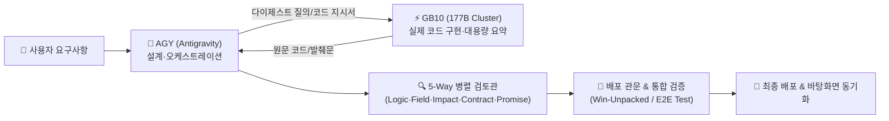

# AGY-GB10 협업 개발 원칙 및 엔지니어링 표준 (v5.2)

이 문서는 **AGY (Google Antigravity / 클라우드 총괄 오케스트레이터)** 와 **GB10 (온프레미스 NVIDIA DGX / Qwen3.8-Flash-Next 177B 클러스터)** 간의 협업 개발 원칙, 제품 아키텍처 연계 표준, 그리고 가짜 데이터를 원천 배제하는 실제 엔지니어링 헌장입니다.

---

## 1. 제품 아키텍처 개요 (GIJO AS & GIJO WIKI)

- **제품 정체성**: 한국형 에어갭 온프레미스 AI 보안 플랫폼 및 지능형 실무 워크스페이스
- **기술 스택**:
  - **프론트엔드/데스크톱**: Electron + Vanilla JS + Pretendard + Mermaid.js (라이트/다크 반응형)
  - **백엔드/엔진**: Node.js/TypeScript + Express (`server/src/engine/*.ts`)
  - **데이터베이스 & RAG**: SQLite (`better-sqlite3`) + LanceDB (`memory.lancedb`) + `bge-m3` 온프렘 임베딩
  - **로컬 LLM 클러스터**: 온프레미스 `llama-server` 프로세스 풀 + GB10 (177B MoE Cluster)

### 🖥️ 분산 3머신 체계 (`win` · `max` · `gb10`)
| 머신 식별자 | 하드웨어 사양 | 네트워크 (VPN) | 역할 및 권한 경계 |
|:---|:---|:---|:---|
| **`win`** | Windows PC (desktop-4qplvnc) | `10.8.0.1` | **주 개발 및 총괄 운영**: 운영 서버(WSL 포트 4000), Git 허브, 클라이언트 빌드 및 게시 |
| **`max`** | M1 Max 32GB (GIJOHNMAC) | `10.8.0.11` | **실기 검증 전담**: macOS DMG 빌드, Metal GPU 가속 검증, 올인원 패키지 E2E 테스트 |
| **`gb10`** | NVIDIA DGX 클러스터 (`gijohn_llm`) | `10.8.0.12` | **고출력 추론 & 토큰 절감**: 온프레미스 177B 추론, 대용량 파일 발췌/다이제스트 (`local-digest.mjs`) |

---

## 2. 역할 분담 및 외부 선진 협업 모범사례

글로벌 선진 AI 협업 패턴(Anthropic Two-Tier Architect, Google Gate-Keeper, GitHub Trunk-Based Review)을 엄격히 적용합니다.

### 1) AGY (Antigravity) — 총괄 아키텍트 & 품질 관문 (Orchestrator)
- **계획 및 인터페이스 설계**: 착수 전 실제 API 필드명, 기존 모듈 의존성, 데이터 스키마 전수 분석
- **UI 추천 시안 1개 원칙**: 시안은 여러 개를 늘어놓지 않고 검증된 최적안 1개를 자체완결 HTML 목업으로 제시
- **직렬 자원 단일 통제**: 운영 서버(4000), CDP 디버깅 포트(9223), 빌드 인스톨러 배포는 AGY가 직접 통제(경합 방지)
- **품질 게이트 검증**: 5갈래 병렬 검토 결과 판정 및 최종 사용자 보고

### 2) GB10 (Qwen3.8-Flash-Next 177B) — 고출력 온프렘 구현 엔진 (Worker)
- **온프레미스 코드 생성**: AGY가 수립한 상세 설계서(파일 경로, 라인 범위, 인터페이스 규격)를 준수하여 실제 코드 블록 구현
- **대용량 파일 토큰 최적화 (`local-digest.mjs`)**:
  - 800줄을 초과하는 대형 파일(`handlers.ts`, `GIJO_AS_고객QA_문항30.md` 등)은 외부 클라우드로 통째로 올리지 않고, **GB10이 로컬에서 핵심을 선별·발췌**하여 토큰 비용을 최소화
- **폐쇄망 기밀 데이터 보호**: 외부 반출이 금지된 고객사 감사로그, 민감 설정 파일의 1차 파싱 및 인덱싱 전담

---

## 3. 개발 파이프라인 5단계 사슬 (Chain of Custody)

1. **시안 (Mockup)**:
   - UI 변경 시 실제 렌더링 가능한 자체완결 HTML 시안을 먼저 확정 (임의 수치 지양, 실제 getBoundingClientRect 실측치 반영).
2. **설계관 (Architect)**:
   - `쓸 API의 실제 필드명이 무엇인가`, `이미 계산된 지표가 존재하는가`, `수정 시 파급되는 2차 연쇄가 있는가` 3대 질문을 착수 전 검증.
3. **구현 (Implementation)**:
   - GB10과 AGY가 협력하여 구체적이고 동작 가능한 실제 코드를 작성.
4. **검토관 병렬화 (5-Way Parallel Review)**:
   - ① 신규 코드 로직 무결성
   - ② 필드명 및 API 원천 대조
   - ③ 기존 화면/부품에 미치는 회귀 영향도
   - ④ 감사 로그 및 계약 누락 여부
   - ⑤ 커밋 메시지/주석과 실제 코드의 일치성
5. **통합 배포 (Release Gate)**:
   - 검토 통과 후에만 배포 진행. 게시가 검토를 앞지르지 않는다.

---

## 4. 가짜 데이터(Dummy) 원천 배제 원칙 (Zero-Fake Guarantee)

- **더미/가짜 데이터 절대 금지**:
  - 임의의 "가짜 고객사", "테스트 1, 2, 3", "더미 텍스트" 등 실제 환경과 무관한 하드코딩은 작성하지 않는다.
- **실물 원본 지식 연동**:
  - 사내 지식고(My Docs Vault)는 파일 시스템에 실재하는 **GIJO AS 공식 원본 문서 9종**(`GIJO_AS_보안제품관리_지침.md`, `GIJO_AS_고객QA_문항30.md`, `GIJO_AS_취약점관리_지침.md` 등 총 96,847자)을 100% 온전히 직접 로드한다.
- **폴백(Fallback) 문구 경계**:
  - API나 파일이 없을 때 단순 에러 메시지나 임의 플레이스홀더로 얼버무리는 것을 결함(FAIL)으로 간주하며, 실제 데이터 원천을 복구하는 안전장치(예: `resetToRealDocs()`)를 탑재한다.
- **정직한 테스트**:
  - 모의(Mock) 테스트가 실제 환경을 대체하여 거짓 성공을 띄우지 않도록, 실제 브라우저/DOM/Node.js 단위에서 실행 가능한 스크립트(`test_gijo_wiki_qa.js`)로 검증한다.

---

## 5. 제품 간 엄격한 격리 수칙 (Boundary Enforcement)

- **GIJO AS 코어 보존**:
  - 기존 `GIJO AS` 제품 파일(`GIJO_AS_*.md`, `server/src/`, `tools/`, `GIJO_AS_*.html`)은 고객사 납품 및 운영 서버에 직접 닿아 있으므로 **절대 무단 수정하거나 덮어쓰지 않는다.**
- **GIJO WIKI & AS Lite 독립성 유지 (전담 작업 폴더 원칙)**:
  - WIKI, ERP 스위트 및 AS Lite의 모든 기능 추가/개선/빌드/테스트 작업은 **`gijo as lite/` 디렉토리 내부에서만 완결**되도록 작업하고 격리 배포한다. 루트 디렉토리의 운영 코어는 절대 침범하지 않는다.
