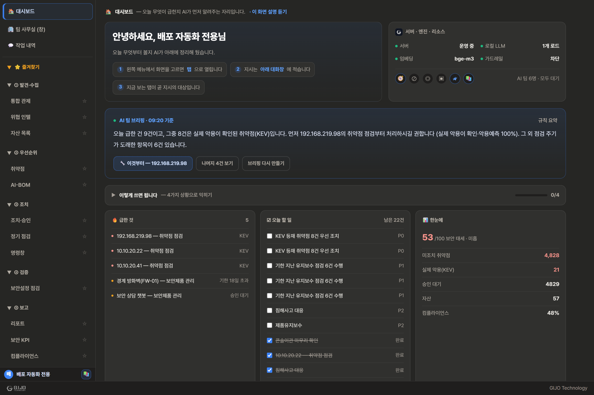
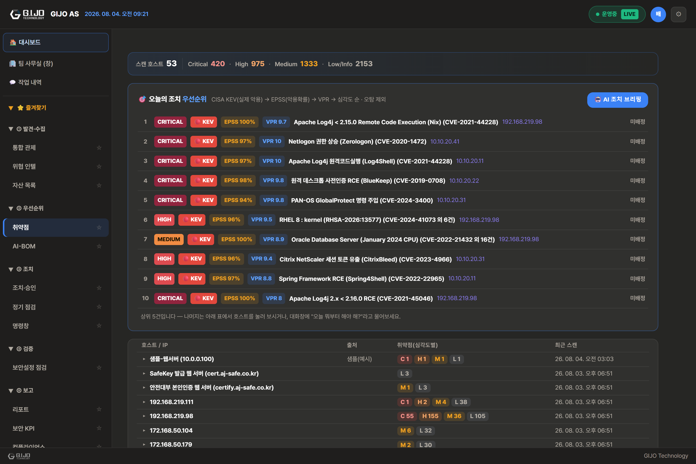
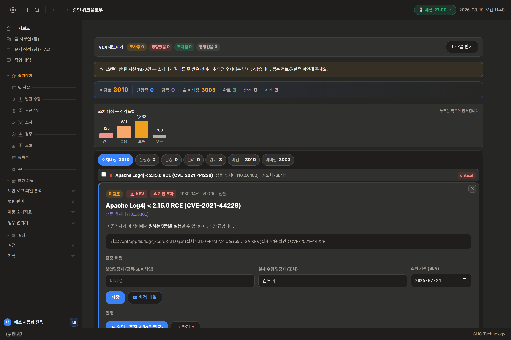
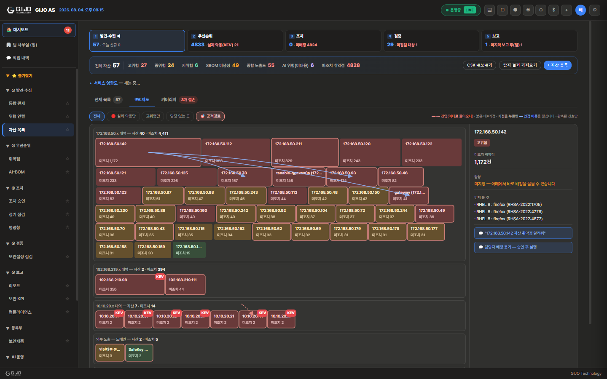
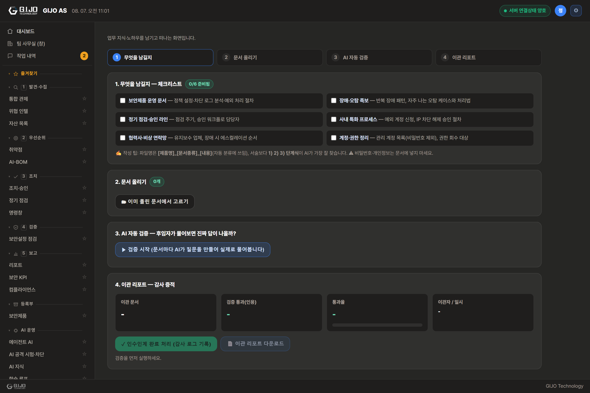
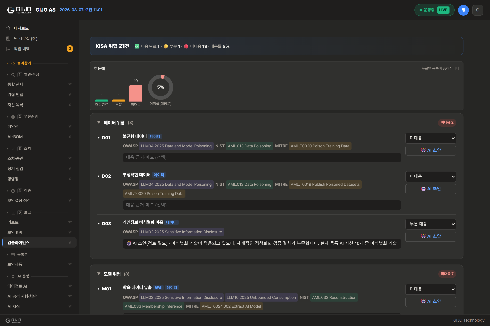
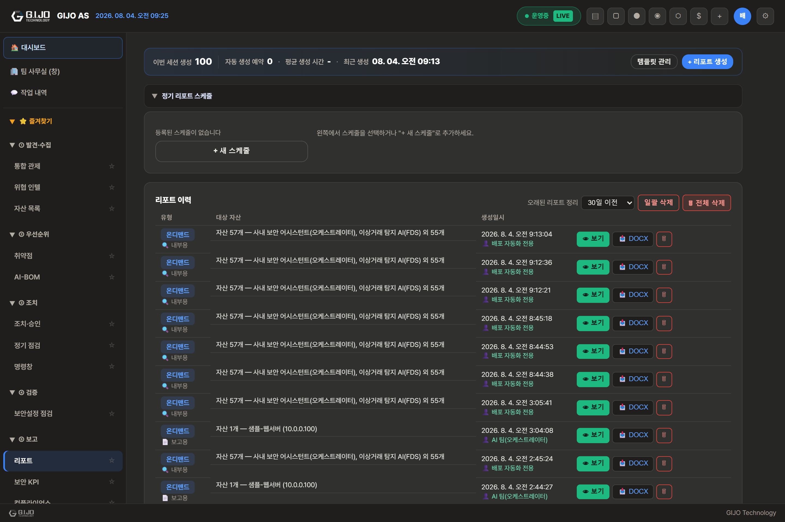
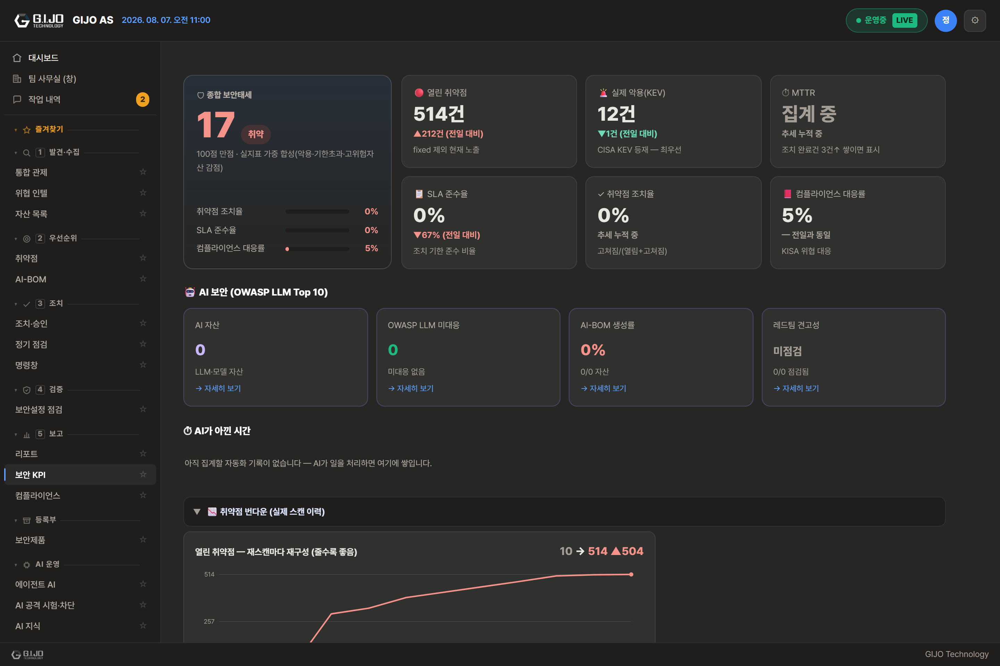

# GIJO AS — 4대 시나리오 시연 패키지 (계획서 전-1)

- 작성: 2026-07-29 · **화면 갱신: 2026-08-07(클라 5.7.2) · 대사 재실측: 2026-08-07 → 2026-08-13** — 지시 10문장을 운영에 다시 던져 대조했다
- **2026-08-13 전수 재실측**(시연 ①~④의 지시 9문장을 운영에 그대로 던짐). 결과:
  - ✅ 그대로 유효: ①"이번 주 예정된 점검", ②ASA 106023(근거 배지까지 정확), ③접속기록 보관 규정, ③v2 두 문항(행동 대조)
  - 🔄 숫자·1위가 바뀜(실데이터가 늘어서다 — 아래 각 발췌를 갱신했다): ①"오늘 뭐부터 볼까?", ④"이번 주 한 일"
  - ★ **깨져 있던 것 1건 — ③"KEV 조치 기한 근거 지침"**. 지침 대신 우리 SLA 표가 나갔다.
    당일 코드로 고쳤으나(`playbook.ts` 출처를묻는말) **운영 배포 전이라 재실측은 아직이다** — 해당 줄에 표시해 두었다.
    ⚠ 배포 전까지 이 문항은 **시연에서 빼거나** 아래 적어 둔 대체 말투로 물으십시오.
- 캡처: `screenshots/deck/` (운영 서버 실데이터, 목업 아님)
  - ⚠ 예전 `demos/` 사진(2026-07-29 · 클라 4.5.0)은 **8월 2일 메뉴 개편 전**이라 지금 화면과 다릅니다.
    보관은 하되 시연·제안에는 쓰지 마십시오 — 고객이 "이 메뉴 어디 있어요?"라고 물으면 답이 없습니다.
- **설치가 막힌 고객에게는 그림부터 보내십시오.** 회사 PC의 EDR이 설치를 막는 사례가 실제로 있었고,
  그때 자료가 글뿐이면 제품을 오해합니다(2026-08-04 파트너 피드백).
- **원칙: 이 대본의 모든 지시는 작성일에 운영 서버에 실제로 던져 확인한 것만 실었다.** 각 시나리오의 "실측 발췌"는 그날 실제 응답의 앞부분 그대로다. 동작이 약한 표현은 대본에서 뺐고 문서 끝 "피해야 할 표현"에 이유와 함께 적었다.
- 시연 전 준비: 운영 서버 기동 확인 → 시연 계정 로그인 → 탭 전부 닫고 대시보드만. 각 시나리오는 5분, 전체 풀코스는 22~25분.

---

## 시연 ① "혼자 남은 월요일 아침" — 인력 부족·업무 과다

**상황 설정(내레이션 30초):** 보안담당자 2명 중 1명이 휴가. 스캐너 리포트는 쌓였고, 오늘 뭐부터 볼지 정하는 것부터가 일입니다.

| 분 | 행동 | 화면 | 핵심 대사 |
|---|---|---|---|
| 0:30 | 앱을 연다 — 아무것도 안 눌렀는데 브리핑이 먼저 와 있다 | 대시보드 (아래 그림) | "출근하면 AI 팀 브리핑이 먼저 와 있습니다 — 오늘 급한 것과 그 이유" |
| 1:30 | 콘솔에 **"오늘 뭐부터 볼까?"** 입력 | 대시보드 콘솔 | "판단 근거가 KEV→EPSS→VPR — 감이 아니라 기준입니다" |
| 2:30 | **"미조치 취약점 알려줘"** → 목록에서 담당 미지정 확인 | 콘솔 | "담당 미지정이 그냥 남은 일이 아니라 막힌 지점으로 표시됩니다" |
| 3:30 | 조치·승인 화면 — 결재판·조치 검증 소개 | 조치·승인 (아래 그림) | "AI가 실행하는 쓰기 작업은 전부 이 결재판을 거칩니다 — **무인화가 아니라 승인 기반 반자동**" |
| 4:30 | **"이번 주 예정된 점검 있어?"** | 콘솔 | "점검 일정까지 한 줄로 — 콘솔 하나가 여러 콘솔을 대신합니다" |

**실측 발췌(재실측 2026-08-13):**
> "오늘 뭐부터 볼까?" → *"오늘 조치 우선순위 상위 5건 (KEV→EPSS→VPR 순): 1. 🔴 [매우 심각] Apache Log4j < 2.15.0 Remote Code Execution (Nix) (CVE-2021-44228) @ 192.168.219.98 — KEV(실제악용) · EPSS 1 · VPR 9.7 | 담당 미지정 …"* (0.4초)
> ⚠ 1위가 바뀌었다(옛 대본은 Oracle CVE-2020-36843). **실데이터라 시연 때 또 바뀔 수 있다** — 대사는 종목 이름이 아니라 **줄 세운 기준**(KEV→EPSS→VPR)에 걸어 두십시오. 그것은 안 바뀐다.
> "이번 주 예정된 점검 있어?" → *"점검 일정 10건 — 기한 초과 7건, 예정 1건, 완료 2건 …"* (0.1초 — 2026-08-13 **그대로 유효**. ⚠기한 초과부터 보여 준다 — 시연에서는 "밀린 점검이 먼저 보입니다"로 잇는 편이 자연스럽다)

> ★ **시연자 주의 — "미조치 취약점 알려줘"에는 경고가 먼저 붙는다**(2026-08-13 실측).
>   답 머리에 *"⚠ 이 숫자에 **조사 정보가 약 95건 섞여 있습니다**(추정) — 취약점이 아니라 스캐너가
>   「무엇이 깔려 있는지」 알아낸 것입니다. 2026-08-04 이전에 올린 결과라 그렇습니다"* 가 나온다.
>   제품이 **스스로 자기 데이터의 한계를 밝히는** 정직한 장치이지만, 아무 설명 없이 화면에 뜨면
>   고객은 "데이터가 지저분하다"로 읽는다. **먼저 말하고 넘어가십시오** —
>   "재분류 전 옛 결과가 섞이면 제품이 먼저 알려 줍니다. 같은 파일을 다시 올리면 갈라서 셉니다."

**마무리 멘트:** "이 시나리오의 값은 기능이 아니라 시간입니다 — 아침 취합 30분이 지시 세 줄이 됩니다."

## 시연 ② "퇴사자의 머릿속을 남기다" — 인수인계 (차별화 1호)

**상황 설정:** 방화벽 담당 5년 차가 다음 달 퇴사. 후임자는 보안 경력 1년.

| 분 | 행동 | 화면 | 핵심 대사 |
|---|---|---|---|
| 0:30 | 인수인계 화면 — 4단계 마법사 | 인수인계 (아래 그림) | "체크리스트 → 문서 담기 → **AI 자동 검증** → 이관 리포트" |
| 1:30 | 3단계 AI 자동 검증 강조 | 인수인계 | "문서를 올렸다고 끝이 아닙니다 — AI가 문서마다 검증 질문을 만들어 **실제로 물어보고, 그 문서가 근거로 인용되는지** 판정합니다" |
| 2:30 | 이관 리포트 — 통과율·이관자·일시가 감사 증적으로 | 인수인계 | "퇴사 후 분쟁의 대비책이기도 합니다 — 무엇을 넘겼는지가 증적으로 남습니다" |
| 3:30 | 후임자 입장: 콘솔에 **"ASA 106023 로그가 한 IP에서 계속 올라오는데 무슨 의미야?"** | 콘솔 | "전임자가 남긴 문서가 근거(📄)로 붙어 답합니다 — 후임자는 물어보는 것만으로 노하우를 받습니다" |
| 4:30 | 기억·학습 화면 — 문서·조각·연결 관리 | 기억·학습 (아래 그림) | "지식은 사람이 아니라 시스템에 남습니다" |

**실측 발췌(재실측 2026-08-13):**
> "ASA 106023 …무슨 의미야?" → *"**%ASA-4-106023** 은 Cisco ASA 방화벽이 **ACL(접근 통제 목록)에 걸려 패킷을 차단**했다는 뜻입니다. 즉 **정상 동작**이며, 「막았다」는 기록입니다. 메시지 읽는 법: `%ASA-4-106023: Deny <프로토콜> src …`"* (0.6초)
> 📄 **근거 배지: `logformat_cisco_asa.md` · `GIJO_지식_보안장비_로그체계.md` · `GIJO_AS_용어사전.md`**
> ★ 이 시나리오의 핵심은 **배지 자체**다. 화면을 손가락으로 짚으며 말하십시오 —
>   "AI가 안다고 우기는 게 아니라, **전임자가 남긴 이 문서를 보고** 답한 것입니다. 문서 이름이 여기 찍힙니다."
>   (2026-08-13 실측에서 배지가 정확히 저 세 문서를 가리켰다. 답도 옛 대본보다 나아져 「읽는 법」까지 준다.)

**마무리 멘트:** "조사에서 보안팀 특화 인수인계 제품은 국내외에서 못 찾았습니다. 2025년 퇴사자발 대형 유출 사고가 보여준 그 공백입니다."

## 시연 ③ "이거 해도 되나?" — 규정·법령 대조

**상황 설정:** 담당자가 개인정보 시스템 접속기록 보관 주기를 바꾸려 한다. 사규와 법이 뭐라는지 바로 알아야 한다.

| 분 | 행동 | 화면 | 핵심 대사 |
|---|---|---|---|
| 0:30 | 콘솔에 **"접속기록 보관 기간 규정 알려줘"** | 콘솔 | "사내에 올린 규정 문서를 근거로 — 1년/2년 기준과 항목·점검 주기까지" |
| 2:00 | **"KEV 조치 기한을 정한 지침 이름이 뭐야?"** ★말투 바뀜 | 콘솔 | "지침 이름과 기한을 근거와 함께 — '아마 그럴걸요'가 없습니다" |
| 3:00 | 컴플라이언스 화면 — KISA 대응 현황 | 컴플라이언스 (아래 그림) | "규정 대응 상태가 항목 단위로 관리됩니다" |
| 4:00 | 설정 > 연동 — 법제처 인증키 패널 | 연동 (설정 → 연동) | "키만 넣으면 국가법령정보와 연결 — 최신 법령·시행령을 원문 링크로. 폐쇄망이면 끄면 됩니다" |

**실측 발췌(재실측 2026-08-13):**
> "접속기록 보관 기간 규정" → *"최소 1년 이상 보관·월 1회 이상 점검… 5만 명 이상·고유식별정보·민감정보 처리 시 2년 이상… 접속기록 항목: 계정·접속일시·접속지 정보(IP 등)·처리한 정보주체 정보·수행업무…"* (3.7초 — **그대로 유효**, 사내 문서 근거로 결정 라우팅)
> "KEV 조치 기한을 정한 지침 이름이 뭐야?" → *"CISA BOD 22-01 지침이 KEV 조치 기한을 정한 근거입니다. 🔎 쉬운 용어 풀이 — **KEV**: Known Exploited Vulnerabilities…"* (1.6초)
>
> ★ **왜 말투를 바꿔 적었나(2026-08-13 실측 — 재현 2/2).** 옛 대본의 말투
>   *"KEV 등재 **취약점** 조치 기한 근거 지침이 뭐야?"* 로 물으면 지침이 아니라
>   **「🛠 조치 플레이북 — 일반 취약점 조치 · 15일 내」 표**가 0.1초에 나왔다.
>   문서(`kev_bod_22-01_조치기한.md`)도 지식도 있는데 **못 닿은 것**이었다 —
>   갈림길은 「취약점」이라는 낱말 하나였고, 그 말이 있으면 무슨 물음이든 플레이북이 채 갔다.
>   → 당일 코드로 고쳤다(`playbook.ts` — 「어떻게 하나」와 「무엇에 근거하나」를 가른다, 커밋 2be30a3).
>   ⚠ **운영 배포 전이라 옛 말투의 재실측은 아직이다.** 배포 후 옛 말투로 다시 재고,
>     통과하면 이 줄의 「★말투 바뀜」 표시를 떼십시오. 그 전까지는 위 말투로 시연하십시오.

**v2 (2026-07-29 오후) — 행동 대조 완성, 대본에 편입:**

| 분 | 행동 | 핵심 대사 |
|---|---|---|
| +1:00 | **"개인정보 시스템 접속기록 보관 주기를 6개월로 줄여도 돼?"** | "허락 질문을 알아듣고 **사내 규정 문서만** 근거로 판정합니다 — 원문 발췌를 코드가 그대로 오려 붙이고, 근거 배지가 달립니다" |
| +2:00 | **"USB 반출 정책 완화해도 돼?"** (규정 문서 없는 주제) | "근거가 없으면 판정하지 않습니다 — '판단 불가, 못 찾았다'가 답입니다. 그 규정 문서를 올리면 그때부터 답합니다" |

**시연자 주의(정직):** ① 판정 기호(○/△/×)는 보수적으로 나올 수 있다 — 주인공은 기호가 아니라 **원문 발췌와 근거 배지**다("최소 1년 이상 보관"이 화면에 그대로 보인다). ② 벤더 매뉴얼은 판정 근거가 되지 못하게 자격 게이트로 막았고, 참고로만 분리 표시된다. ③ 법령은 원문 링크 안내까지만(제목만으로 판정하지 않음) — 이중 면책("사내 규정 대조이며 법률 판단 아님" + "법령 원문 안내이며 법률 자문 아님")이 항상 붙는다. 근거: 로폼 대법원 판결(2026)의 "법률적 판단" 경계, 실서비스 전 법제처 API 약관의 AI 활용 조건 확인 필요(조사 2026-07-29).

## 시연 ④ "보고가 저녁을 먹어치우지 않게" — 상급자 보고

**상황 설정:** 금요일 16시, 팀장이 "주간 현황 정리해서 올려줘".

| 분 | 행동 | 화면 | 핵심 대사 |
|---|---|---|---|
| 0:30 | 콘솔에 **"이번 주 한 일 정리해줘"** — AI가 아낀 시간까지 즉답 | 콘솔 | "말로 된 현황은 즉석에서 — 이번 주 55건, 사람이 했다면 약 17시간" |
| 1:30 | 콘솔에 **"내부 검토용 주간 리포트 작성해줘"** → 요약 + DOCX 파일 경로 (생성 **약 15초** — 그동안 "문서를 만드는 중입니다"라고 말한다) | 콘솔 | "말 한 줄이 격식 문서가 됩니다 — 파일은 리포트 화면에서 바로 열람" |
| 2:00 | 리포트 화면 — [＋ 리포트 생성] 버튼으로도 내부/공식 DOCX·PDF | 리포트 (아래 그림) | "버튼으로도 됩니다 — 내부 검토용과 대외 공식용 두 서식" |
| 2:30 | 정기 스케줄 — 매주 월 09:00 자동 생성 중인 것을 보여줌 | 리포트 | "이미 매주 월요일 아침 자동으로 만들어지고 있습니다(실데이터)" |
| 3:30 | 보안 KPI — 임원 요약·태세 점수·추세 | 보안 KPI (아래 그림) | "임원 보고는 이 화면 그대로 — 점수·감점요인·추세" |
| 4:30 | (선택) 학습 후보함 — 쓸수록 나아지는 구조 | 학습 루프 (아래 그림) | "오늘 한 문답이 내일의 모델을 가르칩니다 — 승인 한 번으로" |

**실측 발췌(재실측 2026-08-13):**
> "이번 주 한 일 정리해줘" → *"최근 7일 — AI가 대신 처리한 일 **102건** · 사람이 했다면 약 **28.7~35.8시간** — 보고서 작성 5건×120분 · 문서 정리·분류 36건×15분 · 조치 검증 13건×30분 · 질문 답변 22건×10분 · 보안설정 점검 4건×45분 …"* (0.1초)
> ⚠ 옛 대본은 55건·16.8~21시간이었다. **실데이터라 시연 때 또 다르다** — 대사는 숫자가 아니라
>   **셈법**("건수 × 기준시간, 보수적으로 20% 깎음")에 걸어 두십시오. 숫자를 외워 말하면 화면과 어긋난다.
> ⚠ "오늘 브리핑 해줘"는 AI가 문장을 짓느라 **12~19초** 걸린다(재실측) — 시연 첫수로 쓰지 말고, 쓰려면 "문장을 지어 드리는 중"이라고 미리 말한다
> "내부 검토용 주간 리포트 작성해줘" → *"…(요약)… (리포트 파일 생성됨: data/reports/ondemand-….docx — 리포트 화면에서 열람·다운로드)"* (당일 수정 후 실측)
> 정기 리포트 스케줄 → *"주간 리포트 · 매주 월 09:00 · 켜짐 · 최근 7/27 성공"* (실등록 상태)

---

## 시연자 주의 — 표현별 동작 (작성일 실측 → **당일 3건 수정 완료**)

| 표현 | 처음 실측 | 수정 후 (2026-07-29 오후, 운영 재실측) |
|---|---|---|
| "주간 보안 리포트 **작성해줘**" | 스케줄 조회로 샜음 | ✅ **실제 DOCX 생성** — 요약과 함께 "(리포트 파일 생성됨: …)" 경로를 답함. ④ 대본에 편입 |
| "방화벽 **반려 사유** 주로 뭐였어?" | 일반론으로 답했음 | ✅ **사내 반려 이력 실데이터**(사유 분포·검토자·날짜)로 답함. 대상 이력이 없으면 없다고 말하고 전체를 보여줌 |
| "○○ 점검은 **어떻게 해?**" | 실제 점검이 실행됐음 | ✅ **실행 안 됨** — 방법 질문과 실행 지시를 코드가 가름. 실행은 "점검해줘" 명령형일 때만 |

→ 셋 다 회귀 시험 8종으로 고정했다(`server/test/routingfixes.test.ts`). 남은 잔결: 방법 질문의 **답 품질**은 지식베이스에 해당 절차 문서가 있어야 좋아진다(장비 절차 문서를 올리면 해결 — 학습이 아니라 문서 문제).

## 공통 문답 (시연 중 자주 나오는 질문)

- **"클라우드로 뭐가 나가나요?"** — 아무것도. 분석하는 AI 자체가 이 서버 GPU에서 도는 오픈모델이다. 법제처 조회만 선택적 인터넷(끄면 완전 폐쇄).
- **"AI가 멋대로 지우거나 바꾸면?"** — 쓰기 작업은 전부 결재판 승인 후 실행, 전 행위 감사 로그(끌 수 없음), 원클릭 undo.
- **"모델이 틀리면?"** — 근거 문서를 함께 표시하고, 못 찾으면 못 찾았다고 답하게 설계(할루시네이션 억제). 남은 한계는 정직 경계 문서에 공개.
