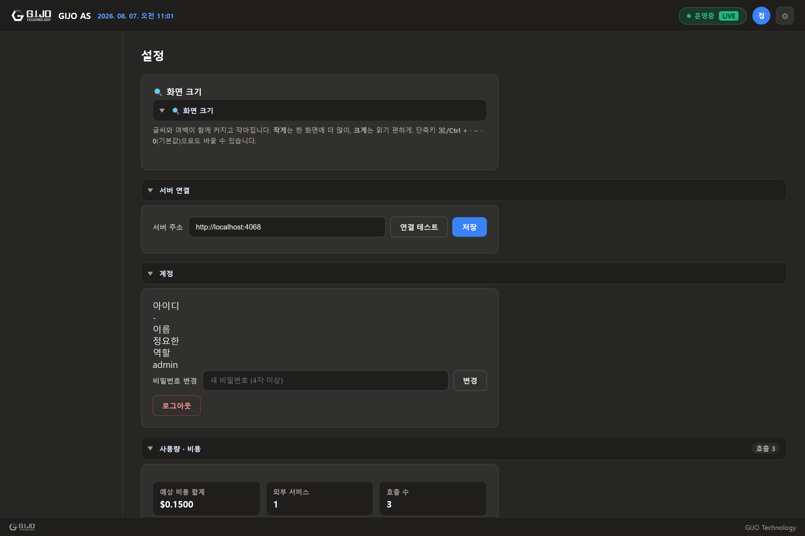
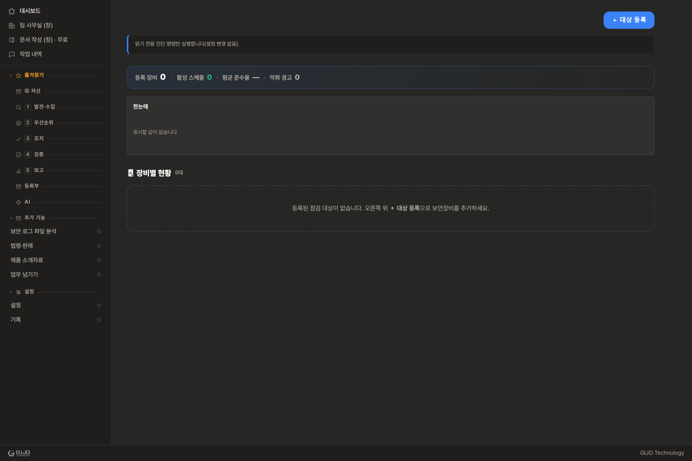

# GIJO AS — 제품 소개 자료

> **한 명의 보안담당자가 여러 명 몫을 해내도록.**
> 쏟아지는 보안 정보를 AI 에이전트가 **자동으로 엮어** 처리하는 온프레미스 보안 운영 플랫폼.

*본 자료의 모든 수치·예시·**스크린샷**은 실제 제품을 구동해 뽑은 값입니다 — 지어낸 것이 아닙니다.*
*스크린샷은 실제 제품 화면(HTML/CSS)을 실측 서버 응답으로 렌더링한 것입니다 — 목업이 아닙니다. (`screenshots/` 폴더)*

---

## 1. 왜 필요한가 — 보안담당자의 현실

기업 보안담당자는 늘 인원이 부족합니다. 그런데 처리해야 할 일과 받는 정보는 계속 늘어납니다.

| 현실의 고충 | 무엇이 힘든가 |
|---|---|
| 보안제품 운영·관리 | 패치·메뉴 확인·장애 대응·발견 문제 전달을 사람이 일일이 추적 |
| 쏟아지는 보안 정보 | 제품 로그, CTI(위협 인텔), 취약점 스캔 결과가 **따로따로** 도착 |
| 정보 간 대조가 수작업 | "이 위협이 우리 어느 자산에?", "이 자산 문제가 어느 서비스에?"를 눈으로 매칭 |
| 반복되는 보고 | 임원·팀장 보고서, KPI를 매번 손으로 취합 |
| AI 보안까지 추가 | 이제 AI 모델 자산·공급망까지 관리 대상 |

> **핵심 문제.** 개별 데이터는 다 있습니다. 서로 연결이 안 되어 있을 뿐이고, 그 연결을 담당자가 머리로 대신하고 있습니다.

---

## 2. GIJO AS 한 줄 정의

보안에 특화된 Agent AI 팀이 로컬 LLM으로 담당자의 업무를 대신합니다. 따로 놀던 보안 정보를
스스로 이어 붙여 "지금 무엇이 위험한지"를 바로 보여줍니다.
데이터도 AI도 폐쇄망(온프레미스) 안에서만 돕니다. 기본 구성에서는 사내 데이터가 밖으로 나가지 않습니다 — 인터넷과 닿는 통로는 모두 목록으로 관리하고(6.6), 봉인 스위치를 켜면 한 번에 막습니다(4.17).

---

## 3. 핵심 가치 3가지

### ① 자동 상관관계 — "정보를 엮어주는" 레이어
개별 사일로(자산·CTI·점검·컴플라이언스)를 자동으로 연결합니다.
```
CTI 위협  →  영향받는 내부 자산  →  영향받는 업무 서비스
스캔 취약점  →  승인 검토  →  SBOM 반영
```

### ② 온프레미스 Agent AI — 데이터 주권
8종 보안 에이전트가 로컬 GPU의 LLM으로 작동. 기본 구성에서는 외부 API·클라우드 없이 폐쇄망에서 완결됩니다.

### ③ 지속 학습 거버넌스 — 쓸수록 똑똑해짐
RAG(장기 기억) + 헤르메스 폐쇄형 학습 루프로 실제 대화를 학습에 반영. 점검·승인은 감사 추적으로 관리.

---

## 4. 주요 기능 (업무 중심)

### 4.1 🤖 에이전트 AI 팀 + 복합 지시
**목적:** 자연어로 지시하면 보안 에이전트 팀이 알아서 협업 처리.

8종 고정 에이전트(실측, 2026-09-03 사서·부품 추가):

| 에이전트 | 역할 | 쓰는 모델 |
|---|---|---|
| 오케스트레이터 | 작업 분배·결과 취합 | 기반 모델 |
| 스캔 | 스캔(ModelScan) 결과 해석 · 자산 finding 반영 | 기반 모델 |
| 분석 | 우선순위 판단 · AI 모델 관리 | 기반 모델 |
| 리포트 | 내부 보고서 작성 | 기반 모델 |
| CTI | 위협 인텔 해석 · CTI ↔ 자산 자동 매칭 | 기반 모델 |
| GIJO | 용어 해설 · 사례 부연(사내 지식 근거) | 기반 모델 |
| 사서(Curator) | 문서 반입 분류 · 세 줄 요약 · 온톨로지 보강 · 검색어 재작성 | 기반 모델 |
| 부품(BOM) | 타사 SBOM 검수 해석 초안 · 라이선스 의무 설명(판정은 규칙 엔진) | 기반 모델 |

기본은 여덟 팀원이 **같은 기반 모델 하나**를 씁니다. 총괄을 뺀 팀원에게는 다른 모델이나, 평가를
통과해 **채택된** 주제 어댑터를 따로 배정할 수도 있습니다(설정 화면에서 지정).

**예전 소개에 있던 「침투테스트 · SBOM · 모델 진화」는 어디로 갔나요.** 없어진 것이 아니라
대화하는 팀원(에이전트) 자리에서 빼고 **전용 화면·엔진**으로 옮겼습니다. 팀원으로 두면
일반적인 설명만 내놓는 중복이었기 때문입니다.

- **SBOM 만들기·내보내기** → 자산 인벤토리·AI-BOM 화면이 맡습니다(4.4).
- **모델 진화(전문가 어댑터 학습)** → 학습 루프가 맡습니다(4.9).
- **침투테스트(익스플로잇 검증)** → **이 제품은 실제로 공격해 뚫어 보지 않습니다.** 대신
  ① 스캔·로그 등 **관측된 신호로 공격 경로를 추정**해 그림으로 보여 주고(화면에도 「침투테스트
  결과가 아니라 추정」이라고 밝힙니다), ② **AI 견고성 시험(레드팀)** 으로 프롬프트 공격 문항
  **30종**을 실제 모델에 보내 뚫리는지 실측하며, ③ **보안설정 하드닝 점검**(KISA U-시리즈·CIS)으로
  장비 설정 취약점을 읽기 전용 진단 명령으로 확인합니다.

> **모델 구성.** 기반 모델은 한 개(현재 배포 Qwen3-14B)이고 역할별 차이는
> 전문가 어댑터(LoRA)로 냅니다. 예전에는 역할마다 다른 7B 모델을 병렬로 띄웠습니다.
> GPU가 하나면 그 병렬이 실제로는 순차라 갈아 끼우는 비용만 커진다는 것을 실측으로 확인했습니다.
> 어댑터는 기반 모델 전체가 아니라 얇은 덧옷이라 메모리도 전환 시간도 훨씬 적게 듭니다.
>
> 고객이 **직접 고른 모델(BYOM)을** 올릴 수도 있습니다 — 올리면 제품이 문맥 길이·생각 과정 표시를
> 자동으로 맞춥니다. 모델마다 라이선스가 다르니 상업적 사용 가능 여부는 도입 전에 확인하세요.

**복합 지시(오케스트레이션):** 여러 작업을 한 문장으로.
> 실측 — 지시: *"CTI 영향 자산 스캔하고 리포트까지"*
> → 자동 계획: **① 스캔(대상=CTI 영향 자산 자동 해석) → ② 리포트 작성** (2단계 복합 실행)

각 단계는 협업 로그에 실시간으로 표시되고 스캔 결과가 그대로 리포트로 이어집니다.




### 4.2 🎯 CTI ↔ 내부 자산 자동 매칭 *(핵심 차별점)*
**목적:** "이 위협이 우리 어느 자산에 영향?"을 자동으로.

CTI 위협의 대상 텍스트를 자산의 구체적 식별자(컴포넌트·CVE·모델명)와 대조합니다.

**실측 — 수집 위협 5건 중 4건이 자산에 매칭, 영향 자산 3곳:**

| 위협 (target) | 심각도 | → 영향 자산 | 매칭 근거 |
|---|---|---|---|
| Qwen2.5 오픈웨이트 모델 가중치 변조 공급망 위협 | 주의 | 사내 보안 상담 챗봇 | `qwen2` |
| bge-m3 임베딩 배포 패키지 악성코드 삽입 | 긴급 | 사내 보안 상담 챗봇 | `bge` |
| KoBERT 분류 모델 대상 프롬프트 인젝션 캠페인 | 주의 | 문서 민감도 분류 AI | `kobert` |
| IsolationForest 이상탐지 우회 PoC 공개 | 정보 | 이상행위 탐지 엔진 | `isolationforest` |
| *(다크웹 계정 유출 — 무관)* | 정보 | *(매칭 없음, 정상 제외)* | — |

> 담당자의 눈 대조 작업을 없앰. 무관한 위협은 오탐 없이 걸러냄.


### 4.3 🔗 서비스 영향도 — 자산 → 업무 서비스
**목적:** "이 자산/보안제품 문제가 어느 업무 서비스에 영향?"을 자동으로.

자산을 업무 서비스로 묶어 위험(자산 취약점·CTI 위협·지연 점검)을 롤업합니다.

**실측 — 서비스 3곳 모두 CTI 위협으로 "영향도 높음":**

| 서비스 | 자산 | 영향도 | 위험 요인 |
|---|---|---|---|
| 임직원 보안 포털 | 사내 보안 상담 챗봇 | **높음** | CTI 위협 1 |
| 문서관리 시스템 | 문서 민감도 분류 AI | **높음** | CTI 위협 1 |
| SOC 관제 플랫폼 | 이상행위 탐지 엔진 | **높음** | CTI 위협 1 |

> **위협 → 자산 → 서비스**까지 한 번에 연결. "지금 위험한 서비스"를 임원에게 바로 설명.


### 4.4 📦 자산 인벤토리 · AI-BOM · SBOM
**목적:** AI 자산뿐 아니라 받는 다양한 정보를 구성명세로 관리하고 취약점을 빠르게 확인.

- **자산 인벤토리:** AI 자산 + 일반 IT 자산(Nessus 업로드), 컴포넌트·소유부서·지원 서비스
- **AI-BOM:** 모델·데이터·프롬프트·도구·인프라 5영역 명세
- **SBOM 내보내기:** CycloneDX **및 SPDX-2.3** 표준 지원


### 4.5 🛡 취약점 생애주기 관리 (Nessus)
**목적:** 취약점을 "목록"이 아니라 **발견 → 우선순위 → 조치 → 측정** 생애주기로 관리(Tenable 방법론 채택).

- **임포트:** Nessus `.nessus`(원본 XML) · CSV · HTML 리포트를 그대로 업로드. **플러그인 단위로 중복 제거**(1,171행 → 282건), 호스트 정보(OS·DNS)·EPSS·VPR·**CISA KEV** 자동 인식
- **우선순위:** CVSS 심각도에 더해 실제 악용확률(EPSS)·KEV로 정렬 — "Medium인데 악용 94%"를 놓치지 않음
- **상태 추적:** 재스캔 대비 New/Active/**Fixed**/Resurfaced 자동 판정. 인증(credentialed) 스캔 여부로 **"Fixed 검증 신뢰도"까지** 표시
- **조치:** 취약점을 담당자·**SLA**(KEV 7일 / Critical 14일 / High 30일…) 붙은 조치 항목으로 전환
- **측정:** 실제 스캔 이력에서 재구성한 **번다운**으로 위험 감소 추적

> 실측 — 샘플 취약 호스트 1대: **Log4Shell**(Critical · CISA KEV 실제 악용) · OpenSSH(High) · Oracle 패치누락(Medium · 악용확률↑) · SSL(**Fixed**로 검증) — 심각도·KEV·상태를 한눈에.
> 실 Nessus 리포트는 **1,171행을 282개 플러그인으로 중복 제거**하는 것도 실데이터로 검증했습니다.


### 4.6 🧰 보안제품 관리 (종류별 + 매뉴얼)
**목적:** 운영 중인 보안제품을 **종류별로 등록**하고, 제품 매뉴얼을 **AI가 학습**해 오케스트레이터가 참고.

- **종류별 등록:** 방화벽·EDR·DLP·WAF·VPN·IPS·SIEM·백신·NAC 카탈로그로 구분 관리, 대시보드에서 한눈에
- **매뉴얼 일괄 업로드:** 파일만 올리면 파일명으로 **어느 제품 문서인지 자동 매칭**(없으면 제품 자동 등록), 로그 관련 파일은 **로그 매뉴얼**로 자동 분류
- **AI 학습(RAG):** 첨부한 매뉴얼은 지식베이스에 자동 수집 → "올린 문서 검색"과 **오케스트레이터 답변에 즉시 반영**
- **점검 연결:** 유지보수 점검과 제품을 이름 매칭으로 연결 → 제품 카드에서 점검 현황(지연·승인대기·다음 점검일) 확인

> 실측 — 4종 제품(방화벽·EDR·DLP·WAF) + 제품/로그 매뉴얼을 종류별 그룹으로 관리.


### 4.7 ✅ 취약점 승인 워크플로우 (거버넌스)
**목적:** 스캔 finding을 검토해 확정/오탐 처리 → SBOM 반영 게이트.

담당자가 finding을 **승인(확정)** 또는 **반려(오탐)** 처리. 반려된 오탐은 SBOM 취약점에서 자동 제외.
finding 내용 해시로 상태를 저장해 **재스캔 후에도 검토 결과 유지.**


### 4.8 🛠 보안제품 운영 가이드 (유지보수 거버넌스)
**목적:** 패치·메뉴 확인·장애 대응을 일정→보고→승인 거버넌스로.

- **지식베이스:** 매뉴얼·에러로그(.log) 업로드 → RAG 검색으로 메뉴 확인·장애처리
- **점검 거버넌스:** 일정 등록 → 결과 보고 → 관리자 승인/반려 (반복주기 자동 생성)
- **이력 타임라인 + 이메일 알림:** 지연 점검을 담당자에게 자동 통지

**실측 — 점검 6건(전 상태 시연):**

| 점검 | 대상 | 상태 |
|---|---|---|
| 방화벽 정책 정기 점검 | 경계 방화벽(FW-01) | 예정(오늘 마감) |
| 프롬프트 가드레일 점검 | 보안 상담 챗봇 | 승인 대기 |
| 학습데이터 접근권한 점검 | 문서 민감도 분류 AI | 승인됨 |
| 오탐 룰 점검 | 이상행위 탐지 엔진 | 반려 |
| WAF 룰셋 점검 | 웹방화벽(WAF-01) | 승인됨 |
| VPN 게이트웨이 인증서 점검 | VPN 게이트웨이(VPN-03) | 예정 |



### 4.9 🔄 로컬 LLM · RAG · 전문가 어댑터 학습 *(2026-08 재설계)*
**목적:** 온프레미스 AI로 연속성 유지, **우리 현장에서 쌓인 문답으로** 분야별 전문가를 길러냄.

- **로컬 LLM:** llama.cpp 멀티모델 풀(GPU 1대 — NVIDIA·Apple 등), 팀원(에이전트)별 모델 배정. 고객이 원하는 모델을
  가져다 쓸 수 있고(BYOM), 모델마다 다른 버릇은 제품이 자동으로 맞춥니다(생각 모드·문맥 길이).
- **RAG(장기 기억):** 사내 문서를 LanceDB에 넣어 검색·근거 주입. **읽을 수 없는 문서는 넣는 순간
  막습니다**(2026-08 관문 신설 — 아래 6.5).
- **전문가 어댑터(LoRA):** 「베이스 1개 + 어댑터 N개」 구조. 주제(취약점·장비운영·사내규정·위협대응)별로
  승인된 문답이 **300건**을 넘으면 그 주제 어댑터를 학습합니다.
  - **등록 ≠ 채택**: 학습된 어댑터는 *미채택* 상태로 등록됩니다. 평가 게이트와 A/B를 통과하고
    사람이 채택해야 실제 답변에 실립니다. 실제로 1호 어댑터는 품질이 모자라 채택하지 않았습니다.
  - 밖에서 받은 어댑터도 대화창 지시 → 결재판 승인으로 반입할 수 있습니다(무결성 검사 포함).
- **학습 재료 위생:** 배포·검증 계정의 대화는 후보에서 **자동 제외**됩니다 — 제품이 아니라 시험을
  배우면 안 되기 때문입니다.


### 4.10 📊 통합 보안 KPI 대시보드
**목적:** 흩어진 지표를 한곳에 + 매일 스냅샷으로 추세 → 임원 보고·방향성 결정.

번다운·SLA 준수율·KEV 추세까지 한 화면에 모읍니다.

**실측 — 통합 스냅샷(2026-07-17):**

| 도메인 | 지표 |
|---|---|
| **취약점(Nessus)** | 열린 3 · **Critical 1**(Log4Shell) · **KEV 1** · 번다운 추세 |
| 자산 | 전체 4 (AI 자산 3 + 취약점 스캔 호스트 1) |
| 유지보수 점검 | 전체 6 · **지연 1** · 승인대기 1 · 승인 2 · 반려 1 |
| CTI 자산영향 | 수집 5 · **자산매칭 4** · **영향 자산 3** · 긴급 3 |
| 컴플라이언스 | KISA 위협 21항목 · 대응률 집계 |
| AI 학습 | 배포 모델 0 (학습 실행 시 누적) |


### 4.11 📄 임원/팀장 보고서
**목적:** KPI·점검 거버넌스·자산 상세를 담은 docx 보고서를 자동 생성(공유는 파일 내려받기).
경영진 요약은 로컬 LLM이 작성, 유지보수 거버넌스 섹션(승인/반려 감사 추적) 포함.


### 4.12 🖥 보안장비 하드닝 점검 · 원격 정기점검 *(신규)*
**목적:** 방화벽·서버 등 보안장비의 설정 취약점을 국내 **CCE(KISA 주요정보통신기반시설 U-시리즈)+CIS** 기준으로 점검.
- 챗봇 명령("○○ 하드닝 점검해줘") 또는 담당자 PC **터미널(CLI — 허용목록·승인·위험차단)로** 즉시 실행 → 분류별 리포트.
- **원격 정기점검**: SSH로 대상을 등록해 **스케줄 자동 점검·이력·악화 알림**(관제 대시보드). 결과는 통합 관제(보안 분석)의 **4번째 소스**로 상관분석에 합류.

### 4.13 🔌 MCP 연동 — AI를 외부 도구에 안전하게 연결 *(준비 중)*
**목적:** AI 에이전트를 외부 도구·데이터(위협 인텔·스캐너·티켓·SIEM)에 **MCP**(Model Context Protocol — AI가 외부 도구를 쓰는 표준 규약)로 연결하는 것이 목표입니다.
- **지금 되는 것:** 설정 화면에 MCP 서버 **등록판 · 에이전트×도구 허용 매트릭스 · 호출 기록**이 준비되어 있습니다. 다만 등록된 서버는 **예시 정의(연동 대기)** 상태이고, 실제 도구 호출은 아직 붙어 있지 않습니다.
- **설계한 온프렘 원칙:** 기본 OFF·관리자만 조작, 밖으로 데이터가 나가는 **원격 서버는 바깥 통신(egress) 승인**을 받아야 켤 수 있습니다. 전송 방식은 stdio(로컬)/HTTP(원격)로 구분합니다.
- 실제 연결이 언제 붙는지는 도입 상담에서 확인해 주세요.

### 4.14 🧭 한 곳에서 지시 · 작업 기록(감사)
**목적:** AI에게는 **대화창 한 곳에서만** 자연어로 지시합니다 — 입구가 둘이면 오조작이 생기므로 화면은 보여 주는 일만 맡습니다. 지시한 일이 어떻게 흘러갔는지는 **「내 문서 > 작업 내역」** 에서 되짚고, 모든 **실행·승인·차단·변경**은 **「설정 > 기록」** 의 단일 타임라인(감사 로그)에 남아 추적됩니다.

### 4.15 🗂 메뉴가 곧 업무 순서 — 5대 메뉴 *(2026-08 재편)*
**목적:** 메뉴를 데이터 창고가 아니라 일하는 순서로 세웁니다. 담당자가 취약점 한 바퀴를 도는 데
그룹 세 곳을 오가던 것을 없앴습니다. 왼쪽 메뉴는 다섯 묶음입니다.

- **① 🧠 내 지식** — 학습한 것을 대화로 묻고 확인합니다(지식 창고 · 법령·판례 · GIJO AS 안내 · 보안제품 비교·소개).
- **② 📓 내 문서** — 올리고, 쓰고, 되찾습니다(업로드·반입 · 문서작성 · 내 문서 목록 · 나만의 연락처 · 업무 넘기기 · 작업 내역 · 지켜보는 폴더 · 조치 요청서).
- **③ 🩹 취약점 업무** — **⓪ 자산 고르기**로 범위를 정하고, **① 발견·수집 → ② 우선순위 → ③ 조치 → ④ 검증 → ⑤ 보고** 다섯 단계가 각각 **허브 한 화면**입니다. 허브 위쪽 띠에서 현황을 한눈에 보고, 판을 누르면 아래 무대에서 그 화면이 열립니다. 보안 로그 파일 분석도 이 묶음에 있습니다.
- **④ 🧰 보안제품 관리** — 우리 보안제품 · 자산 관리(전체) · 보안설정 점검(하드닝) · 정기 점검 · 공급망 점검.
- **⑤ ⚙ 설정** — 설정 · AI(팀·지식·학습·안전장치) · 기록(감사·진단).
- **지시는 대화창 한 곳에서만** 받습니다 — 화면은 보여 주는 일만 합니다(오조작·이중 입구 방지).

### 4.16 🧾 로그 분석 · 보안제품 비교·소개 · 업무 넘기기 *(2026-08)*

세 기능은 각각 **③ 취약점 업무 · ① 내 지식 · ② 내 문서** 메뉴 안에 들어 있습니다(예전의 「추가 기능」 묶음은 없어졌습니다).

- **보안 로그 파일 분석:** 올린 로그 파일을 대장으로 쌓고, **그 로그에 등장한 내부 IP 중 아직 자산으로
  등록되지 않은 것**을 골라 체크 한 번으로 등록합니다. 이벤트 유형(브루트포스·포트스캔·차단 폭주·웹공격)에는
  KISA 기준의 **4단계 대응 절차**가 붙습니다(모르는 유형에는 절차를 지어내지 않습니다).
- **보안제품 비교·소개(옛 제품 소개자료):** 벤더 제품 소개서를 분류해 목록으로 쌓고 **최대 3개까지 표로 비교**합니다.
  보안제품 **매뉴얼과는 별도 대장**이며, 처음 올릴 때 결재판으로 확인합니다. 근거가 없는 칸은
  지어내지 않고 「—」로 둡니다.
- **업무 넘기기:** 인수인계 문서를 근거 배지와 함께 자동 구성합니다.

### 4.17 🔐 입력 개인정보 가리기 · 에어갭 봉인 *(2026-08)*
- **개인정보 가리기:** 담당자가 대화창에 붙여 넣은 **주민등록번호·카드번호**는 AI에 닿기 전에 가려집니다
  (생년월일·Luhn 검증으로 오탐 차단). 업무에 필요한 IP·호스트명은 건드리지 않습니다.
- **에어갭 봉인:** 스위치 하나로 내부를 뺀 모든 바깥 통신을 막습니다(기본은 차단입니다).
  나갈 수 있는 통로는 목록으로 관리하고, 봉인 상태는 대화창에서 물어보면 됩니다.

---

## 5. 한눈에 보는 상관관계 (백데이터 요약)

```
[샘플 CTI 위협 5건]                [내부 자산 3종]              [업무 서비스 3곳]
 Qwen2.5 공급망 위협  ──매칭(qwen2)──▶ 사내 보안 상담 챗봇  ──▶ 임직원 보안 포털   [영향도 높음]
 bge-m3 악성 패키지   ──매칭(bge)────▶ 사내 보안 상담 챗봇
 KoBERT 프롬프트인젝션 ─매칭(kobert)──▶ 문서 민감도 분류 AI  ──▶ 문서관리 시스템    [영향도 높음]
 IsolationForest 우회 ─매칭(isol...)─▶ 이상행위 탐지 엔진    ──▶ SOC 관제 플랫폼   [영향도 높음]
 다크웹 계정 유출     ──(무관, 제외)
```
> 위협이 도착하면 영향 자산에서 영향 서비스까지 자동으로 이어집니다. 담당자는 "무엇부터"만 정하면 됩니다.

---

## 6. 아키텍처 및 적용 기술

### 6.1 시스템 구성 (한눈에)


**3계층 · 단일 GPU 머신 완결형:**
```
[보안담당자 데스크톱(Electron, N대)]
        │  REST(요청/응답) + WebSocket(실시간 7채널)
        ▼
[GIJO AS 서버 — Node.js/Express, 상태 단독 소유]
   인증 · 오케스트레이션 · 상관관계 엔진 · 거버넌스/집계 · 자산/SBOM · CTI · 알림 · 영속화(SQLite)
        │  같은 머신 내 localhost 프로세스 호출
        ▼
[로컬 AI 실행 영역 — GPU 1대 (NVIDIA · Apple 통합메모리 등)]
   로컬 LLM 서빙(llama.cpp, 베이스 1 + 전문가 어댑터 N) · RAG 벡터DB(LanceDB) ·
   AI 자산 스캔(ModelScan) · 어댑터 학습(QLoRA — 학습 전용 파이썬 환경)
```
> 서버 1대가 모든 상태를 단독으로 갖고 여러 데스크톱 클라이언트가 REST/WebSocket으로 붙는 구조입니다.
> 서버와 AI, 데이터가 한 GPU 머신 안에서 끝나기 때문에 폐쇄망 배포에 잘 맞습니다.

### 6.2 적용 기술 스택 (레이어별)

| 레이어 | 기술 | 역할 |
|---|---|---|
| **클라이언트** | Electron 31 · TypeScript · esbuild | 데스크톱 앱. `contextBridge` preload로 안전한 API 표면만 노출 |
| | apiClient(REST) · wsClient(WebSocket) | 서버 통신 · 실시간 이벤트 수신 |
| **서버(웹)** | Node.js · Express 4 · TypeScript | REST API + 앱 조립. `ws`로 WebSocket 브로드캐스트 |
| | JWT(jsonwebtoken) · bcryptjs | 담당자별 로그인(회전형 refresh 토큰) · 비밀번호 해시 |
| | better-sqlite3 (SQLite, WAL) | 자산·점검·승인·KPI·계정 등 전 상태 영속화 |
| | AES-256-GCM(cryptopack) | CTI/SMTP 비밀키 암호화 저장(평문 저장 안 함) |
| **문서/표준** | @cyclonedx/cyclonedx-library | SBOM CycloneDX 1.5 생성 |
| | (직접 생성) SPDX-2.3 JSON | SBOM SPDX 내보내기 |
| | docx | 임원/팀장 리포트(.docx) 생성 |
| | nodemailer(SMTP) | 조치 배정·점검 지연·정기 알림 이메일 |
| | simple-git | 리포지토리 스캔(자산 자동 등록) |
| **AI/데이터** | llama.cpp | 로컬 LLM 서빙(채팅 :8080+ 멀티모델 풀, 임베딩 :8081) |
| | LanceDB · Apache Arrow | 장기 기억(RAG) 벡터 저장·검색 |
| | BGE-M3 | 임베딩 모델(RAG 검색용) |
| | ModelScan (python) | AI 모델 파일 정적 취약점 스캔 |
| | transformers · peft · bitsandbytes | 주제별 전문가 어댑터(QLoRA 4bit) 학습 — 학습 전용 환경에서 실행 |
| | llama.cpp convert_lora_to_gguf · llama-quantize | 학습 산출을 GGUF 어댑터로 변환·양자화 |
| | pypdf / OWPML | 문서(PDF·HWPX·에러로그) 텍스트 추출 — **인입 전 필수 관문** |
| **프로토콜** | MCP(Model Context Protocol) | 외부 도구 연동 표준 — 등록·권한·기록 판까지 준비, 실제 연결은 준비 중(4.13) |

### 6.3 실시간 처리 — WebSocket 이벤트 채널(7종)
서버가 상태 변화를 모든 접속 클라이언트에 즉시 브로드캐스트합니다(폴링 없음):
`collaboration:event`(에이전트 협업) · `llm:event`(추론 실황) · `asset:updated`(자산 갱신) ·
`finetune:progress` · `learnloop:progress`(학습 진행) · `hf-download:progress`(모델 다운로드) · `log:event`(서버 로그)

### 6.4 핵심 데이터 흐름
1. **복합 지시:** 자연어 → **입력 관문**(개인정보 가리기·가드레일) → 의도 라우팅(규칙 우선, 로컬 LLM 보조)
   → 다단계 실행 → 쓰기는 **결재판 승인 후** 실행 → 협업 로그 실시간 표출
2. **RAG:** 문서 → **글자 꺼내기(추출 관문)** → 청크·위생 판정 → **인입 품질 판정** → 임베딩(BGE-M3)
   → LanceDB → 검색(의미+글자 두 갈래 합침) → 관련성 게이트 → 근거 주입
3. **어댑터 학습:** 대화 수집(SQLite) → 후보함(자동화 계정 제외) → 담당자 승인 → 주제 300건 도달 시
   QLoRA 학습 → GGUF 어댑터 변환 → **미채택 등록** → 평가 게이트·A/B → 사람이 채택해야 서빙 반영
4. **상관관계:** CTI 위협 텍스트 ↔ 자산 식별자 토큰 매칭 → 영향 자산 → 서비스 영향도 롤업

### 6.5 지식이 오염되지 않게 하는 관문 *(2026-08 신설)*
지식 저장소는 넣을 때 지킵니다. 검색할 때 걸러 내는 것만으로는 이미 늦습니다.

| 관문 | 무엇을 막나 | 어긋나면 생기는 일 |
|---|---|---|
| **글자 꺼내기** | PDF·한글·오피스 문서를 글자로 그냥 읽는 것 | 압축 바이트가 「지식」이 되어 검색 상위를 차지 |
| **조각 위생** | 사람이 읽을 수 없는 조각(제어문자·인코딩 덩어리) | 근거 자리를 쓰레기가 밀어냄 → AI가 지어냄 |
| **인입 품질 판정** | 걸러 낸 뒤 남은 게 거의 없는 문서를 성공 처리 | "지식 N조각"이라 건강해 보이는 착시 |
| **숨은 지시문 차단** | 밖에서 받은 문서에 심긴 조종 문장 | 문서 한 줄이 우리 AI의 행동을 바꿈 |

> 지식은 넣는 순간 지켜야 합니다. 읽을 수 없는 문서가 섞이면 조각 수만 늘어 지식이 풍부해 보입니다.
> 정작 검색은 그 쓰레기를 위로 올려 진짜 근거를 밀어냅니다.
> GIJO AS는 그런 문서가 들어오면 성공한 척하지 않고 그 자리에서 알립니다.

### 6.6 보안·배포 특성 (폐쇄망 설계)
| 항목 | 내용 |
|---|---|
| **데이터 주권** | 대화·문서·학습·자산·리포트 전 과정이 **조직 내부에서 완결** |
| 외부 연결 | 인터넷으로 나갈 수 있는 통로는 **전부 목록으로 관리**합니다 — 위협 인텔(CTI) 피드 · CISA KEV 갱신 · 법령 조회 · 모델 검색·다운로드 · 외부 저장소 스캔 · URL 지식화(웹·유튜브 자막) · 메일(SMTP) · SIEM 전달 · 원격 장비 점검(SSH) · 외부 AI 대상 점검 · 학습·병합 도구(python·모델 배포처 CLI) · **선택적 클라우드 LLM**(기본 OFF, 관리자만 켤 수 있고 사내 식별자가 섞이면 자동 차단). 필요 없는 것은 끄고, 지금 무엇이 열려 있는지는 화면에서 그대로 확인합니다 |
| GPU 조율 | 학습·병합 시 추론 엔진 자동 정지→재기동(GPU 1대를 나눠 쓰다 생기는 메모리 충돌 방지) |
| 인증·권한 | 보안담당자별 로그인(JWT), admin/담당자 이분 권한 |
| 비밀정보 | API키·SMTP 비밀번호 AES-256-GCM 암호화(평문 저장 안 함) |
| **품질** | 기능은 실제 기동으로 검증하고, AI 답변에는 근거(참고한 문서·원문 대목)를 붙여 확인 가능하게 합니다 |

### 6.7 확장·운영
- **모델 자유 교체:** **설정** 화면에서 보안·학습·RAG·경량 모델을 용도별로 검색·다운로드하고 팀원(에이전트)별로 배정
- **자산 자동 유입:** Nessus `.nessus`/CSV/HTML 업로드 · Git 리포지토리 스캔으로 자산 자동 등록
- **보안제품·매뉴얼:** 종류별 제품 등록 + 매뉴얼 일괄 업로드(파일명 자동 분류·제품 자동 등록) → RAG 학습
- **모델 자산 관리:** AI-BOM 5영역(모델·데이터·프롬프트·도구·인프라) + SBOM 표준 내보내기
- **전문가 어댑터(LoRA):** 기반 모델 하나에 주제별 어댑터를 갈아 끼워 역할을 나눔 — 평가 게이트·A/B 통과 후에만 채택(모델 합성은 고급 옵션으로 보존)

---

## 7. 스크린샷 목록 (`screenshots/` 폴더)

아래 12장은 **실제 제품 화면**을 실측 서버 응답 데이터로 렌더링한 것입니다(1440×960, 2배 해상도).

> 스크린샷은 **2026-08-09에 촬영한 화면**입니다. 그 뒤 메뉴를 **5대 묶음**으로 다시 세웠으므로(4.15),
> 사진 속 **왼쪽 메뉴 구성은 지금 제품과 다릅니다.** 화면별 최신 모습은 제품에서 직접 확인해 주세요.

| 파일 | 화면 | 보이는 실측 데이터 |
|---|---|---|
| `01-보안KPI대시보드.png` | 보안 KPI | 취약점 번다운·KEV·SLA + 자산·점검·CTI·KISA |
| `02-CTI위협-자산매칭.png` | 위협 인텔리전스 | 매칭 4건 → 자산 3곳(근거 토큰) |
| `03-AI자산-서비스영향도.png` | AI 자산 | 서비스 3곳 모두 "영향도 높음" |
| `deck/25-원격정기점검.png` | 원격 정기 점검 | 점검 거버넌스(운영 가이드에서 이관, 2026-08) |
| `05-승인워크플로우.png` | 승인 워크플로우 | finding 검토 게이트 |
| `06-헤르메스학습루프.png` | 헤르메스 학습 루프 | 수집→정제→학습→배포 |
| `deck/21-설정-사용자관리.png` | 설정 | 모델 검색·받기·배정(추천 LLM 가이드에서 이관, 2026-08) |
| `08-에이전트AI.png` | 에이전트 AI | 에이전트 카드 + 지시창 + 협업 로그 |
| `09-컴플라이언스.png` | 컴플라이언스 | KISA 위협 21항목 |
| `10-AI-BOM-SBOM.png` | AI-BOM | 자산별 SBOM 생성/내보내기 |
| `11-취약자산관리-생애주기.png` | 취약 자산관리 | Nessus 임포트·Critical 1(Log4Shell)·KEV·심각도 집계 |
| `12-보안제품관리-매뉴얼.png` | 보안제품 관리 | 종류별 4제품·제품/로그 매뉴얼·점검 연결 |

> 이 화면들은 제품 기본 상태에서 찍은 것입니다. **우리 환경의 실제 화면**이 필요하면
> GIJO AS 앱에 로그인해 각 메뉴에서 직접 촬영하시면 됩니다.

---

*데이터 기준일: 2026-08-10 · 수치는 실제 제품을 구동해 뽑은 값입니다.*
*스크린샷은 2026-08-09 촬영분입니다(실측 데이터 렌더링 — 목업 아님).*
