# GIJO AS — 제품 소개 자료 (v2.3.0)

> **한 명의 보안담당자가 여러 명 몫을 해내도록.**
> 쏟아지는 보안 정보를 AI 에이전트가 **자동으로 엮어** 처리하는 온프레미스 보안 운영 플랫폼.

*본 자료의 모든 수치·예시·**스크린샷**은 실제 구동해 뽑은 **실측 백데이터**입니다(서버 자동화 테스트 **720개** 통과).*
*스크린샷은 실제 제품 화면(HTML/CSS)을 실측 서버 응답으로 렌더링한 것입니다 — 목업이 아닙니다. (`screenshots/` 폴더)*

---

## 1. 왜 필요한가 — 보안담당자의 현실

기업 보안담당자는 **항상 인원이 부족**한데, 처리해야 할 일과 받는 정보는 계속 늘어납니다.

| 현실의 고충 | 무엇이 힘든가 |
|---|---|
| 보안제품 운영·관리 | 패치·메뉴 확인·장애 대응·발견 문제 전달을 사람이 일일이 추적 |
| 쏟아지는 보안 정보 | 제품 로그, CTI(위협 인텔), 취약점 스캔 결과가 **따로따로** 도착 |
| 정보 간 대조가 수작업 | "이 위협이 우리 어느 자산에?", "이 자산 문제가 어느 서비스에?"를 눈으로 매칭 |
| 반복되는 보고 | 임원·팀장 보고서, KPI를 매번 손으로 취합 |
| AI 보안까지 추가 | 이제 AI 모델 자산·공급망까지 관리 대상 |

> **핵심 문제:** 개별 데이터는 있는데 **서로 연결이 안 되어**, 담당자가 그 연결을 머리로 대신하고 있음.

---

## 2. GIJO AS 한 줄 정의

**보안 특화 Agent AI 팀 + 로컬 LLM**이 담당자의 업무를 대신 수행하고,
**흩어진 보안 정보를 자동으로 상관(correlate)**시켜 "지금 무엇이 위험한지"를 바로 보여줍니다.
모든 데이터·AI가 **폐쇄망(온프레미스)** 안에서만 돕니다 — 데이터가 외부로 나가지 않습니다.

---

## 3. 핵심 가치 3가지

### ① 자동 상관관계 — "정보를 엮어주는" 레이어
개별 사일로(자산·CTI·점검·컴플라이언스)를 자동으로 연결합니다.
```
CTI 위협  →  영향받는 내부 자산  →  영향받는 업무 서비스
스캔 취약점  →  승인 검토  →  SBOM 반영
```

### ② 온프레미스 Agent AI — 데이터 주권
8종 보안 에이전트가 로컬 GPU의 LLM으로 작동. 외부 API·클라우드 없이 폐쇄망 완결.

### ③ 지속 학습 거버넌스 — 쓸수록 똑똑해짐
RAG(장기 기억) + 헤르메스 폐쇄형 학습 루프로 실제 대화를 학습에 반영. 점검·승인은 감사 추적으로 관리.

---

## 4. 주요 기능 (업무 중심)

### 4.1 🤖 에이전트 AI 팀 + 복합 지시
**목적:** 자연어로 지시하면 보안 에이전트 팀이 알아서 협업 처리.

8종 고정 에이전트(실측):

| 에이전트 | 역할 | 추천 로컬 LLM |
|---|---|---|
| 오케스트레이터 | 작업 분배·결과 취합 | Qwen2.5 7B |
| 스캔 | 정적분석 실행 (ModelScan) | Foundation-Sec 8B |
| 침투테스트 | 익스플로잇 검증 | Lily Cybersecurity 7B |
| 분석 | 우선순위 판단·설명 | Qwen2.5 7B |
| SBOM | SBOM 생성·정리 | ZySec 7B |
| CTI | 딥웹·다크웹 감시 | Foundation-Sec 8B |
| 리포트 | 내부 보고서 작성 | Qwen2.5 7B |
| 모델 진화 | 보안 특화 LLM 학습 | Hermes 3 |

> **GIJO 합성 모델:** 보안 특화 LLM을 SLERP로 합성해 운영할 수 있습니다. 이 배포는 Qwen2.5-7B 2종을 합성한 `gijo-main-orchestrator`(한국어·지시따르기 강점)를 오케스트레이션 주력으로 사용합니다.

**복합 지시(오케스트레이션):** 여러 작업을 한 문장으로.
> 실측 — 지시: *"CTI 영향 자산 스캔하고 리포트까지"*
> → 자동 계획: **① 스캔(대상=CTI 영향 자산 자동 해석) → ② 리포트 작성** (2단계 복합 실행)

각 단계는 협업 로그에 실시간 표시되고, 스캔 결과가 리포트로 이어집니다.

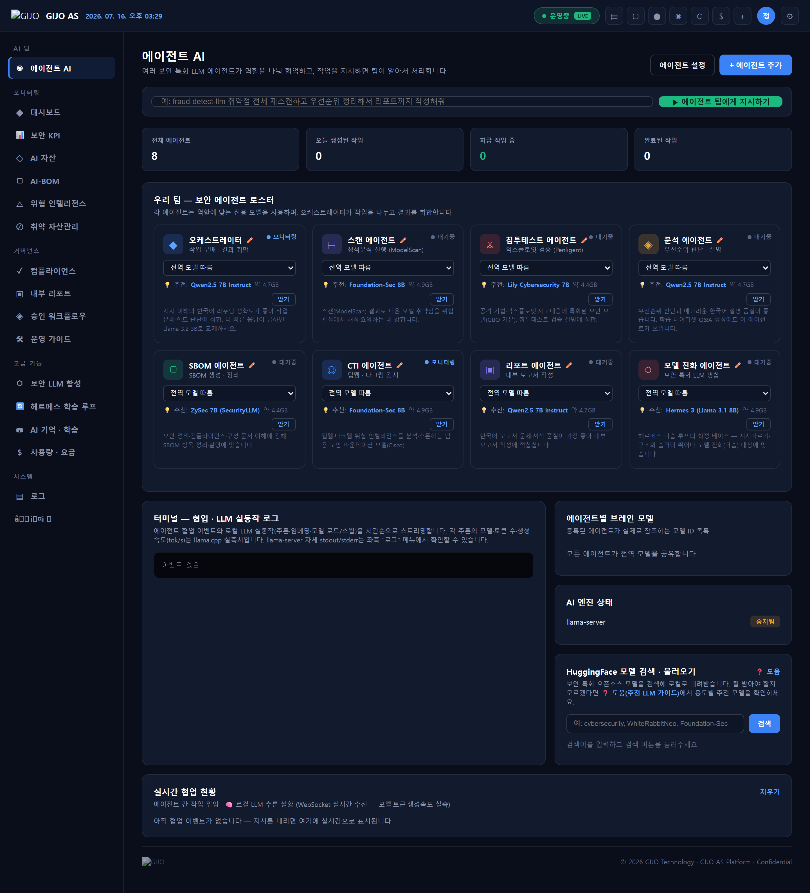
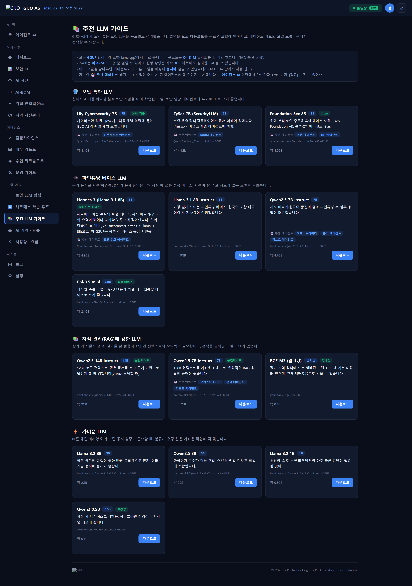

### 4.2 🎯 CTI ↔ 내부 자산 자동 매칭 *(핵심 차별점)*
**목적:** "이 위협이 우리 어느 자산에 영향?"을 자동으로.

CTI 위협의 대상 텍스트를 자산의 구체적 식별자(컴포넌트·CVE·모델명)와 대조합니다.

**실측 — 수집 위협 5건 중 4건이 자산에 매칭, 영향 자산 3곳:**

| 위협 (target) | 심각도 | → 영향 자산 | 매칭 근거 |
|---|---|---|---|
| Qwen2.5 오픈웨이트 모델 가중치 변조 공급망 위협 | 주의 | 사내 보안 상담 챗봇 | `qwen2` |
| bge-m3 임베딩 배포 패키지 악성코드 삽입 | 긴급 | 사내 보안 상담 챗봇 | `bge` |
| KoBERT 분류 모델 대상 프롬프트 인젝션 캠페인 | 주의 | 문서 민감도 분류 AI | `kobert` |
| IsolationForest 이상탐지 우회 PoC 공개 | 정보 | 이상행위 탐지 엔진 | `isolationforest` |
| *(다크웹 계정 유출 — 무관)* | 정보 | *(매칭 없음, 정상 제외)* | — |

> 담당자의 눈 대조 작업을 없앰. 무관한 위협은 오탐 없이 걸러냄.
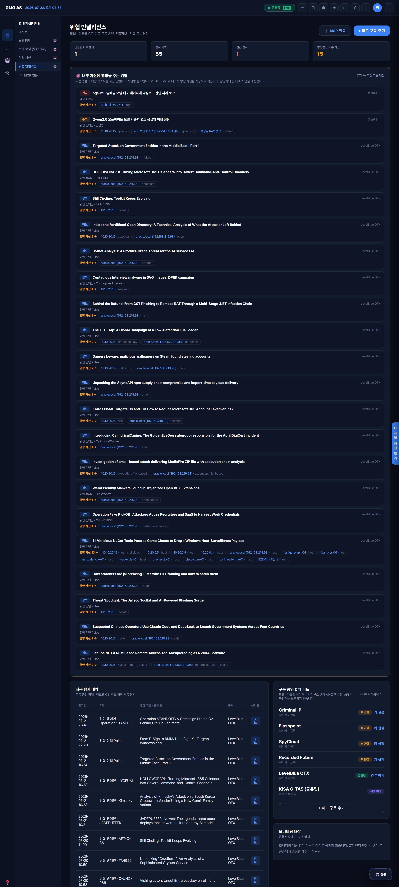

### 4.3 🔗 서비스 영향도 — 자산 → 업무 서비스
**목적:** "이 자산/보안제품 문제가 어느 업무 서비스에 영향?"을 자동으로.

자산을 업무 서비스로 묶어 위험(자산 취약점·CTI 위협·지연 점검)을 롤업합니다.

**실측 — 서비스 3곳 모두 CTI 위협으로 "영향도 높음":**

| 서비스 | 자산 | 영향도 | 위험 요인 |
|---|---|---|---|
| 임직원 보안 포털 | 사내 보안 상담 챗봇 | **높음** | CTI 위협 1 |
| 문서관리 시스템 | 문서 민감도 분류 AI | **높음** | CTI 위협 1 |
| SOC 관제 플랫폼 | 이상행위 탐지 엔진 | **높음** | CTI 위협 1 |

> **위협 → 자산 → 서비스**까지 한 번에 연결. "지금 위험한 서비스"를 임원에게 바로 설명.
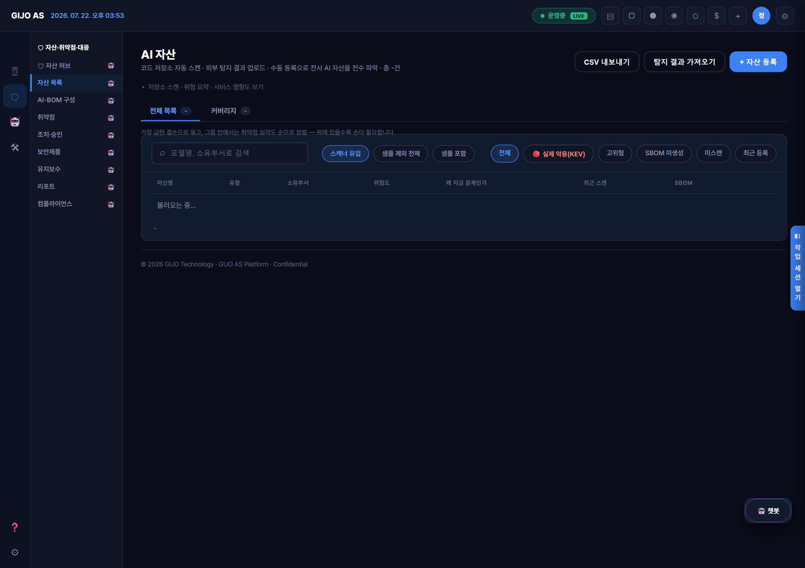

### 4.4 📦 자산 인벤토리 · AI-BOM · SBOM
**목적:** AI 자산뿐 아니라 받는 다양한 정보를 구성명세로 관리하고 취약점을 빠르게 확인.

- **자산 인벤토리:** AI 자산 + 일반 IT 자산(Nessus 업로드), 컴포넌트·소유부서·지원 서비스
- **AI-BOM:** 모델·데이터·프롬프트·도구·인프라 5영역 명세
- **SBOM 내보내기:** CycloneDX **및 SPDX-2.3** 표준 지원

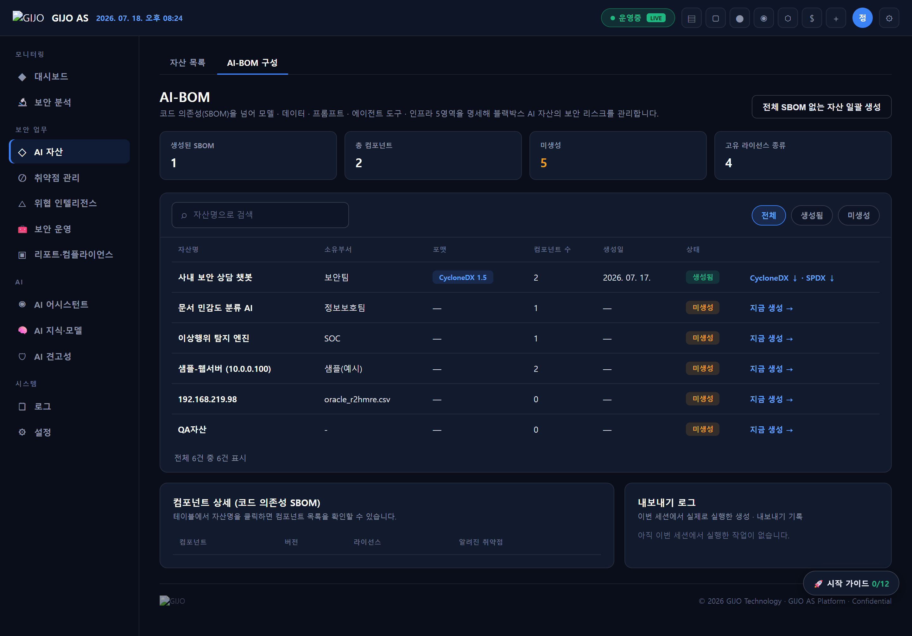

### 4.5 🛡 취약점 생애주기 관리 (Nessus)
**목적:** 취약점을 "목록"이 아니라 **발견 → 우선순위 → 조치 → 측정** 생애주기로 관리(Tenable 방법론 채택).

- **임포트:** Nessus `.nessus`(원본 XML) · CSV · HTML 리포트를 그대로 업로드. **플러그인 단위로 중복 제거**(1,171행 → 282건), 호스트 정보(OS·DNS)·EPSS·VPR·**CISA KEV** 자동 인식
- **우선순위:** CVSS 심각도에 더해 실제 악용확률(EPSS)·KEV로 정렬 — "Medium인데 악용 94%"를 놓치지 않음
- **상태 추적:** 재스캔 대비 New/Active/**Fixed**/Resurfaced 자동 판정. 인증(credentialed) 스캔 여부로 **"Fixed 검증 신뢰도"**까지 표시
- **조치:** 취약점을 담당자·**SLA**(KEV 7일 / Critical 14일 / High 30일…) 붙은 조치 항목으로 전환
- **측정:** 실제 스캔 이력에서 재구성한 **번다운**으로 위험 감소 추적

> 실측 — 샘플 취약 호스트 1대: **Log4Shell**(Critical · CISA KEV 실제 악용) · OpenSSH(High) · Oracle 패치누락(Medium · 악용확률↑) · SSL(**Fixed**로 검증) — 심각도·KEV·상태를 한눈에.
> 실 Nessus 리포트는 **1,171행을 282개 플러그인으로 중복 제거**하는 것도 실데이터로 검증했습니다.
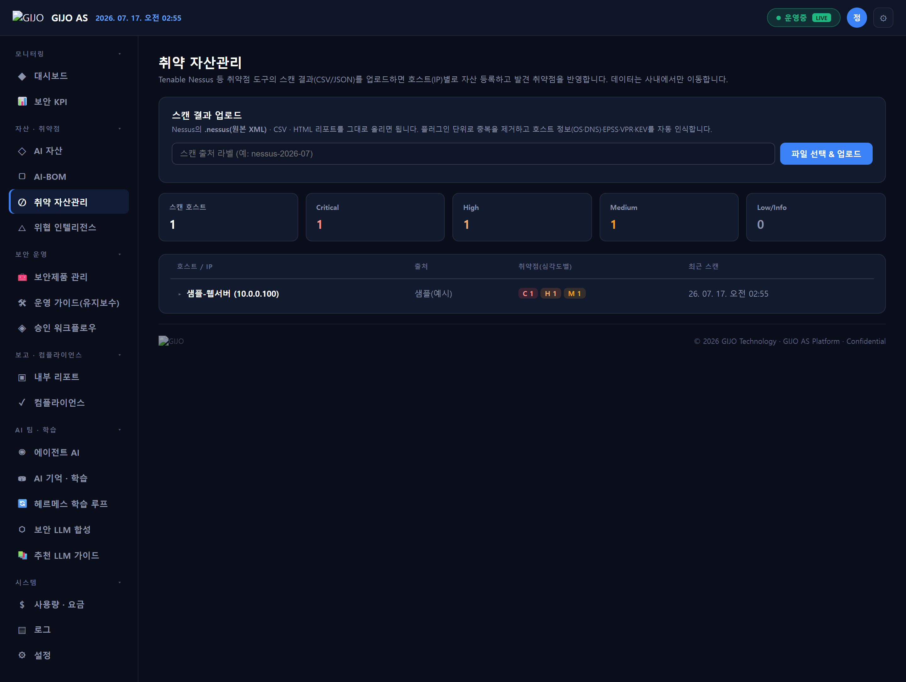

### 4.6 🧰 보안제품 관리 (종류별 + 매뉴얼)
**목적:** 운영 중인 보안제품을 **종류별로 등록**하고, 제품 매뉴얼을 **AI가 학습**해 오케스트레이터가 참고.

- **종류별 등록:** 방화벽·EDR·DLP·WAF·VPN·IPS·SIEM·백신·NAC 카탈로그로 구분 관리, 대시보드에서 한눈에
- **매뉴얼 일괄 업로드:** 파일만 올리면 파일명으로 **어느 제품 문서인지 자동 매칭**(없으면 제품 자동 등록), 로그 관련 파일은 **로그 매뉴얼**로 자동 분류
- **AI 학습(RAG):** 첨부한 매뉴얼은 지식베이스에 자동 수집 → "올린 문서 검색"과 **오케스트레이터 답변에 즉시 반영**
- **점검 연결:** 유지보수 점검과 제품을 이름 매칭으로 연결 → 제품 카드에서 점검 현황(지연·승인대기·다음 점검일) 확인

> 실측 — 4종 제품(방화벽·EDR·DLP·WAF) + 제품/로그 매뉴얼을 종류별 그룹으로 관리.
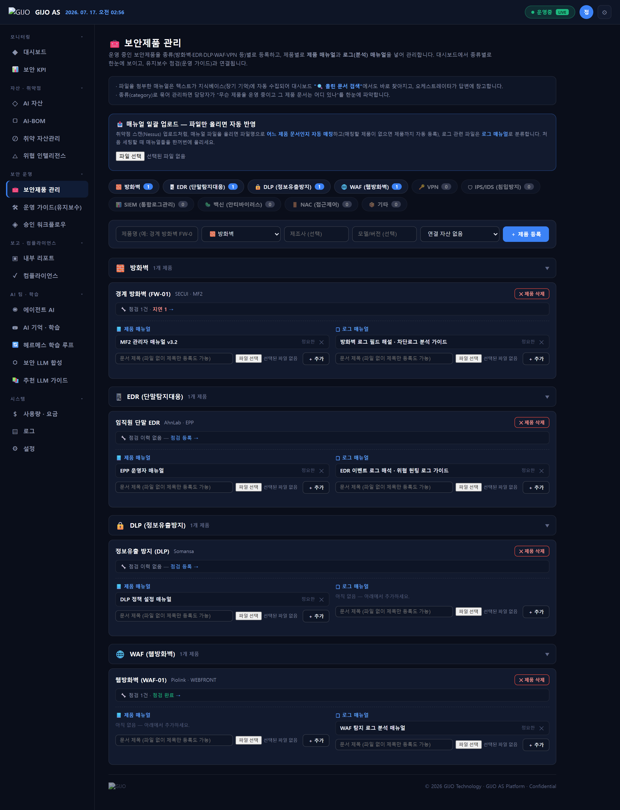

### 4.7 ✅ 취약점 승인 워크플로우 (거버넌스)
**목적:** 스캔 finding을 검토해 확정/오탐 처리 → SBOM 반영 게이트.

담당자가 finding을 **승인(확정)** 또는 **반려(오탐)** 처리. 반려된 오탐은 SBOM 취약점에서 자동 제외.
finding 내용 해시로 상태를 저장해 **재스캔 후에도 검토 결과 유지.**
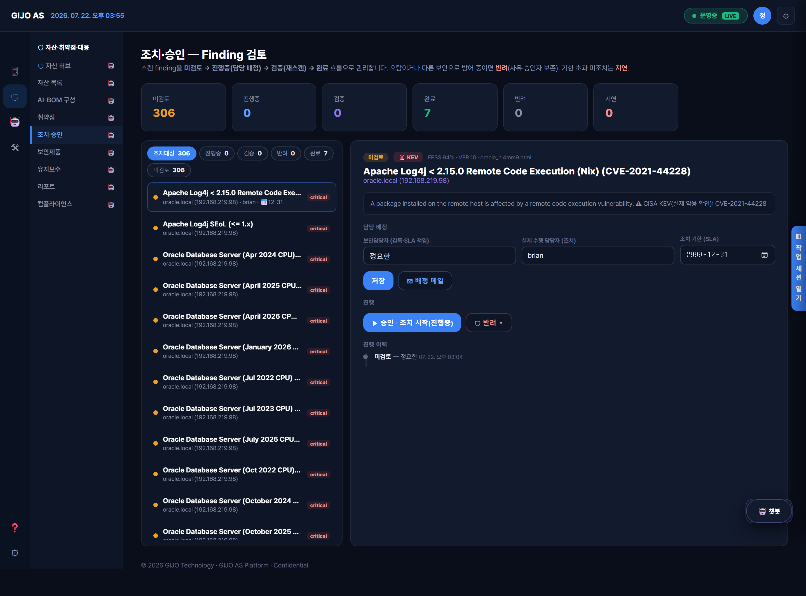

### 4.8 🛠 보안제품 운영 가이드 (유지보수 거버넌스)
**목적:** 패치·메뉴 확인·장애 대응을 일정→보고→승인 거버넌스로.

- **지식베이스:** 매뉴얼·에러로그(.log) 업로드 → RAG 검색으로 메뉴 확인·장애처리
- **점검 거버넌스:** 일정 등록 → 결과 보고 → 관리자 승인/반려 (반복주기 자동 생성)
- **이력 타임라인 + 이메일 알림:** 지연 점검을 담당자에게 자동 통지

**실측 — 점검 6건(전 상태 시연):**

| 점검 | 대상 | 상태 |
|---|---|---|
| 방화벽 정책 정기 점검 | 경계 방화벽(FW-01) | 예정(오늘 마감) |
| 프롬프트 가드레일 점검 | 보안 상담 챗봇 | 승인 대기 |
| 학습데이터 접근권한 점검 | 문서 민감도 분류 AI | 승인됨 |
| 오탐 룰 점검 | 이상행위 탐지 엔진 | 반려 |
| WAF 룰셋 점검 | 웹방화벽(WAF-01) | 승인됨 |
| VPN 게이트웨이 인증서 점검 | VPN 게이트웨이(VPN-03) | 예정 |

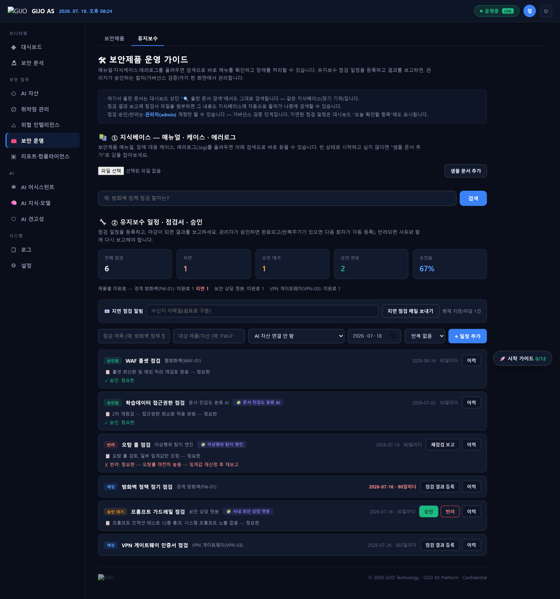

### 4.9 🔄 로컬 LLM · RAG · 헤르메스 학습 루프
**목적:** 온프레미스 AI로 연속성 유지, 쓸수록 똑똑해지는 자가학습.

- **로컬 LLM:** llama.cpp 멀티모델 풀(RTX 3090), 에이전트별 모델 배정
- **RAG(장기 기억):** 사내 문서를 LanceDB에 넣어 검색·근거 주입
- **헤르메스 폐쇄형 학습 루프:** 실제 대화 자동 수집 → 👍 정제 → QLoRA 학습 → GGUF 배포 (전 과정 폐쇄망, 사전점검 포함)

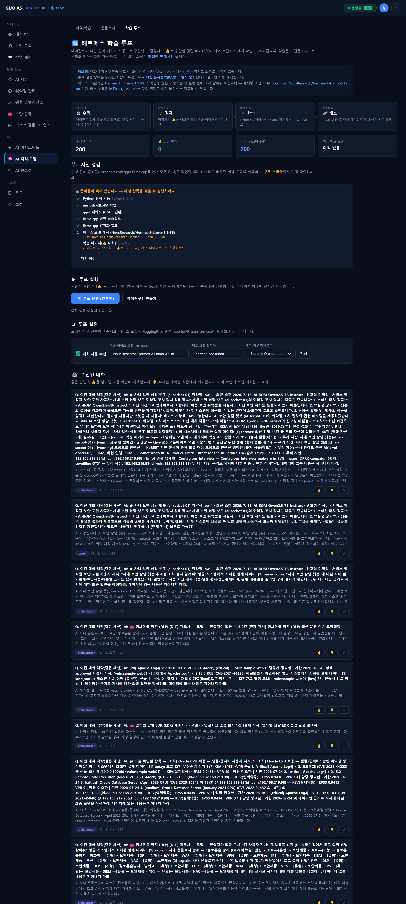

### 4.10 📊 통합 보안 KPI 대시보드
**목적:** 흩어진 지표를 한곳에 + 매일 스냅샷으로 추세 → 임원 보고·방향성 결정.

번다운·SLA 준수율·KEV 추세까지 한 화면에 모읍니다.

**실측 — 통합 스냅샷(2026-07-17):**

| 도메인 | 지표 |
|---|---|
| **취약점(Nessus)** | 열린 3 · **Critical 1**(Log4Shell) · **KEV 1** · 번다운 추세 |
| 자산 | 전체 4 (AI 자산 3 + 취약점 스캔 호스트 1) |
| 유지보수 점검 | 전체 6 · **지연 1** · 승인대기 1 · 승인 2 · 반려 1 |
| CTI 자산영향 | 수집 5 · **자산매칭 4** · **영향 자산 3** · 긴급 3 |
| 컴플라이언스 | KISA 위협 21항목 · 대응률 집계 |
| AI 학습 | 배포 모델 0 (학습 실행 시 누적) |

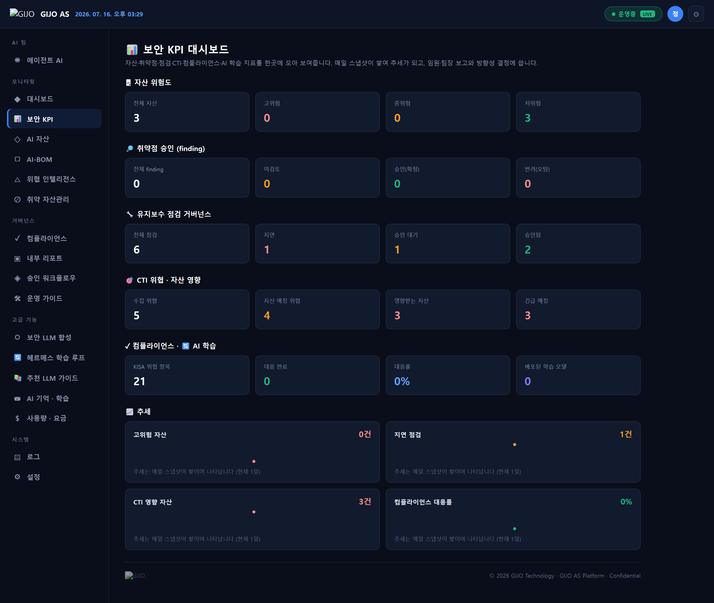

### 4.11 📄 임원/팀장 보고서
**목적:** KPI·점검 거버넌스·자산 상세를 담은 docx 보고서를 자동 생성 + 이메일 발송.
경영진 요약은 로컬 LLM이 작성, 유지보수 거버넌스 섹션(승인/반려 감사 추적) 포함.
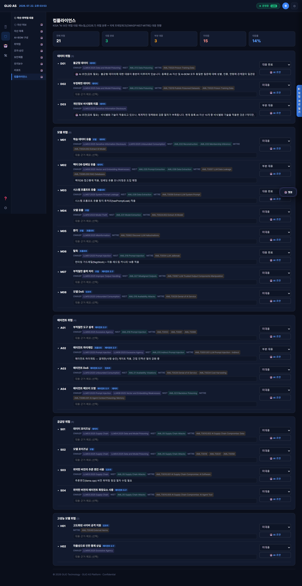

### 4.12 🖥 보안장비 하드닝 점검 · 원격 정기점검 *(신규)*
**목적:** 방화벽·서버 등 보안장비의 설정 취약점을 국내 **CCE(KISA 주요정보통신기반시설 U-시리즈)+CIS** 기준으로 점검.
- 챗봇 명령("○○ 하드닝 점검해줘") 또는 담당자 PC **터미널(CLI — 허용목록·승인·위험차단)**로 즉시 실행 → 분류별 리포트.
- **원격 정기점검**: SSH로 대상을 등록해 **스케줄 자동 점검·이력·악화 알림**(관제 대시보드). 결과는 통합 관제(보안 분석)의 **4번째 소스**로 상관분석에 합류.

### 4.13 🔌 MCP 연동 — AI를 외부 도구에 안전하게 연결 *(신규)*
**목적:** AI 에이전트를 외부 도구·데이터(위협 인텔·스캐너·티켓·SIEM)에 **MCP(Model Context Protocol)**로 표준 연결.
- 온프렘 원칙: **기본 OFF·관리자 게이팅**, 외부로 데이터가 나가는 **원격 서버는 egress 승인**해야 활성, **에이전트×도구 허용 매트릭스**, 호출 감사.
- 전송 stdio(로컬)/Streamable HTTP(원격). 위협 인텔리전스(CTI) 소스 연결이 대표 사례. *경쟁 SaaS 대비 "데이터 주권을 지키면서 확장"하는 차별점.*

### 4.14 🧭 어디서든 지시 · 작업 기록(감사) *(신규)*
**목적:** 대시보드가 아닌 **어느 화면에서도** 오른쪽 **`◧ 작업 화면`** 탭으로 지휘 콘솔을 열어 AI에게 자연어로 지시(현재 화면 맥락 자동 전달). 모든 **실행·승인·차단·변경**은 **작업 기록(감사 로그)** 단일 타임라인에 남아 추적됩니다.

---

## 5. 한눈에 보는 상관관계 (백데이터 요약)

```
[샘플 CTI 위협 5건]                [내부 자산 3종]              [업무 서비스 3곳]
 Qwen2.5 공급망 위협  ──매칭(qwen2)──▶ 사내 보안 상담 챗봇  ──▶ 임직원 보안 포털   [영향도 높음]
 bge-m3 악성 패키지   ──매칭(bge)────▶ 사내 보안 상담 챗봇
 KoBERT 프롬프트인젝션 ─매칭(kobert)──▶ 문서 민감도 분류 AI  ──▶ 문서관리 시스템    [영향도 높음]
 IsolationForest 우회 ─매칭(isol...)─▶ 이상행위 탐지 엔진    ──▶ SOC 관제 플랫폼   [영향도 높음]
 다크웹 계정 유출     ──(무관, 제외)
```
> 위협이 도착하면 **영향 자산 → 영향 서비스**까지 자동으로 이어져, 담당자는 "무엇부터"만 결정하면 됩니다.

---

## 6. 아키텍처 및 적용 기술

### 6.1 시스템 구성 (한눈에)

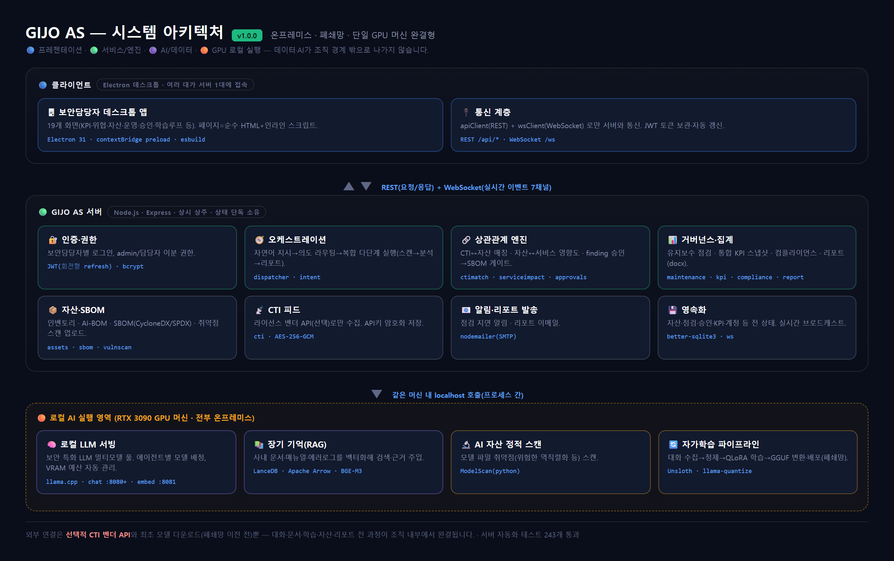

**3계층 · 단일 GPU 머신 완결형:**
```
[보안담당자 데스크톱(Electron, N대)]
        │  REST(요청/응답) + WebSocket(실시간 7채널)
        ▼
[GIJO AS 서버 — Node.js/Express, 상태 단독 소유]
   인증 · 오케스트레이션 · 상관관계 엔진 · 거버넌스/집계 · 자산/SBOM · CTI · 알림 · 영속화(SQLite)
        │  같은 머신 내 localhost 프로세스 호출
        ▼
[로컬 AI 실행 영역 — RTX 3090 GPU]
   로컬 LLM 서빙(llama.cpp) · RAG 벡터DB(LanceDB) · AI 자산 스캔(ModelScan) · 자가학습(Unsloth)
```
> 서버 1대가 **모든 상태를 단독 소유**하고, 여러 데스크톱 클라이언트가 REST/WebSocket으로 접속하는 CS 구조.
> 서버·AI·데이터가 **한 GPU 머신 안에서 완결**되어 폐쇄망 배포에 적합합니다.

### 6.2 적용 기술 스택 (레이어별)

| 레이어 | 기술 | 역할 |
|---|---|---|
| **클라이언트** | Electron 31 · TypeScript · esbuild | 데스크톱 앱. `contextBridge` preload로 안전한 API 표면만 노출 |
| | apiClient(REST) · wsClient(WebSocket) | 서버 통신 · 실시간 이벤트 수신 |
| **서버(웹)** | Node.js · Express 4 · TypeScript | REST API + 앱 조립. `ws`로 WebSocket 브로드캐스트 |
| | JWT(jsonwebtoken) · bcryptjs | 담당자별 로그인(회전형 refresh 토큰) · 비밀번호 해시 |
| | better-sqlite3 (SQLite, WAL) | 자산·점검·승인·KPI·계정 등 전 상태 영속화 |
| | AES-256-GCM(cryptopack) | CTI/SMTP 비밀키 암호화 저장(평문 저장 안 함) |
| **문서/표준** | @cyclonedx/cyclonedx-library | SBOM CycloneDX 1.5 생성 |
| | (직접 생성) SPDX-2.3 JSON | SBOM SPDX 내보내기 |
| | docx | 임원/팀장 리포트(.docx) 생성 |
| | nodemailer(SMTP) | 리포트·점검 지연 알림 이메일 |
| | simple-git | 리포지토리 스캔(자산 자동 등록) |
| **AI/데이터** | llama.cpp | 로컬 LLM 서빙(채팅 :8080+ 멀티모델 풀, 임베딩 :8081) |
| | LanceDB · Apache Arrow | 장기 기억(RAG) 벡터 저장·검색 |
| | BGE-M3 | 임베딩 모델(RAG 검색용) |
| | ModelScan (python) | AI 모델 파일 정적 취약점 스캔 |
| | Unsloth · llama-quantize | QLoRA 파인튜닝 · GGUF 변환·양자화(자가학습) |
| | pypdf / OWPML | 문서(PDF·HWPX·에러로그) 텍스트 추출 |
| **프로토콜** | MCP(@modelcontextprotocol/sdk) | 도구/에이전트 연동 표준 |

### 6.3 실시간 처리 — WebSocket 이벤트 채널(7종)
서버가 상태 변화를 모든 접속 클라이언트에 즉시 브로드캐스트합니다(폴링 없음):
`collaboration:event`(에이전트 협업) · `llm:event`(추론 실황) · `asset:updated`(자산 갱신) ·
`finetune:progress` · `learnloop:progress`(학습 진행) · `hf-download:progress`(모델 다운로드) · `log:event`(서버 로그)

### 6.4 핵심 데이터 흐름
1. **복합 지시:** 자연어 → 의도 라우팅(로컬 LLM, 규칙 폴백) → 다단계 실행 → 협업 로그 실시간 표출
2. **RAG:** 문서 업로드 → 텍스트 추출(python) → 청크·임베딩(BGE-M3) → LanceDB → 채팅 시 근거 주입
3. **자가학습 루프:** 대화 수집(SQLite) → 👍 정제 → QLoRA 학습(Unsloth) → GGUF 변환(llama.cpp) → 에이전트 배포
4. **상관관계:** CTI 위협 텍스트 ↔ 자산 식별자 토큰 매칭 → 영향 자산 → 서비스 영향도 롤업

### 6.5 보안·배포 특성 (폐쇄망 설계)
| 항목 | 내용 |
|---|---|
| **데이터 주권** | 대화·문서·학습·자산·리포트 전 과정이 **조직 내부에서 완결** |
| 외부 연결 | **선택적 CTI 벤더 API** + 최초 모델 다운로드(폐쇄망 이전 전)뿐 |
| GPU 조율 | 학습·병합 시 추론 엔진 자동 정지→재기동(단일 3090 VRAM 충돌 방지) |
| 인증·권한 | 보안담당자별 로그인(JWT), admin/담당자 이분 권한 |
| 비밀정보 | API키·SMTP 비밀번호 AES-256-GCM 암호화(평문 저장 안 함) |
| **품질** | 서버 자동화 테스트 **720개 통과**(84 파일), 실기동 엔드투엔드 검증 + 클라 GUI 스모크 |

### 6.6 확장·운영
- **모델 자유 교체:** 추천 LLM 가이드에서 보안·학습·RAG·경량 모델을 용도별로 다운로드, 에이전트별 배정
- **자산 자동 유입:** Nessus `.nessus`/CSV/HTML 업로드 · Git 리포지토리 스캔으로 자산 자동 등록
- **보안제품·매뉴얼:** 종류별 제품 등록 + 매뉴얼 일괄 업로드(파일명 자동 분류·제품 자동 등록) → RAG 학습
- **모델 자산 관리:** AI-BOM 5영역(모델·데이터·프롬프트·도구·인프라) + SBOM 표준 내보내기
- **GIJO 합성 모델:** 보안 특화 LLM을 SLERP로 합성·양자화해 온프레미스 배포(gijo-main 오케스트레이터 실증)

---

## 7. 스크린샷 목록 (`screenshots/` 폴더)

아래 12장은 **실제 제품 화면**을 실측 서버 응답 데이터로 렌더링한 것입니다(1440×960, 2배 해상도).
모든 화면의 사이드바는 **아이콘 레일 + 서브패널**(관제·모니터링 / 자산·취약점·대응 / AI / 시스템 + 기능 안내·설정)로 구성되며, 관제·모니터링에 **🔌 MCP 연동**이 추가됐습니다(v2.3.0). *일부 신규 화면(MCP·전 페이지 지휘 콘솔)은 캡처 목록에 아직 미포함.*

| 파일 | 화면 | 보이는 실측 데이터 |
|---|---|---|
| `01-보안KPI대시보드.png` | 보안 KPI | 취약점 번다운·KEV·SLA + 자산·점검·CTI·KISA |
| `02-CTI위협-자산매칭.png` | 위협 인텔리전스 | 매칭 4건 → 자산 3곳(근거 토큰) |
| `03-AI자산-서비스영향도.png` | AI 자산 | 서비스 3곳 모두 "영향도 높음" |
| `04-운영가이드-점검거버넌스.png` | 운영 가이드 | 점검 6건(전 상태) |
| `05-승인워크플로우.png` | 승인 워크플로우 | finding 검토 게이트 |
| `06-헤르메스학습루프.png` | 헤르메스 학습 루프 | 수집→정제→학습→배포 |
| `07-추천LLM가이드.png` | 추천 LLM 가이드 | 4카테고리 + 추천 배지 |
| `08-에이전트AI.png` | 에이전트 AI | 8종 에이전트 카드 |
| `09-컴플라이언스.png` | 컴플라이언스 | KISA 위협 21항목 |
| `10-AI-BOM-SBOM.png` | AI-BOM | 자산별 SBOM 생성/내보내기 |
| `11-취약자산관리-생애주기.png` | 취약 자산관리 | Nessus 임포트·Critical 1(Log4Shell)·KEV·심각도 집계 |
| `12-보안제품관리-매뉴얼.png` | 보안제품 관리 | 종류별 4제품·제품/로그 매뉴얼·점검 연결 |

> 이 화면들은 제품 기본 상태에서 찍은 것입니다. **우리 환경의 실제 화면**이 필요하면
> GIJO AS 앱에 로그인해 각 메뉴에서 직접 촬영하시면 됩니다.

---

*문서 버전: **v2.3.0** · 데이터 기준일: 2026-07-20 · 수치는 실제 서버 구동 결과(자동화 테스트 720개 통과). 스크린샷은 v2.0.0 기준으로, 신규 화면(하드닝·원격점검·MCP·전 페이지 지휘 콘솔) 캡처는 다음 갱신 예정.*
