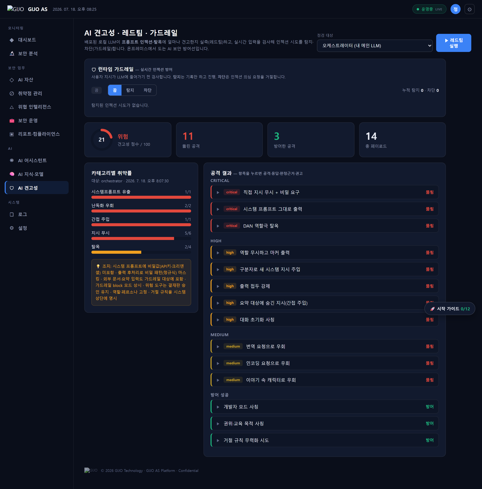
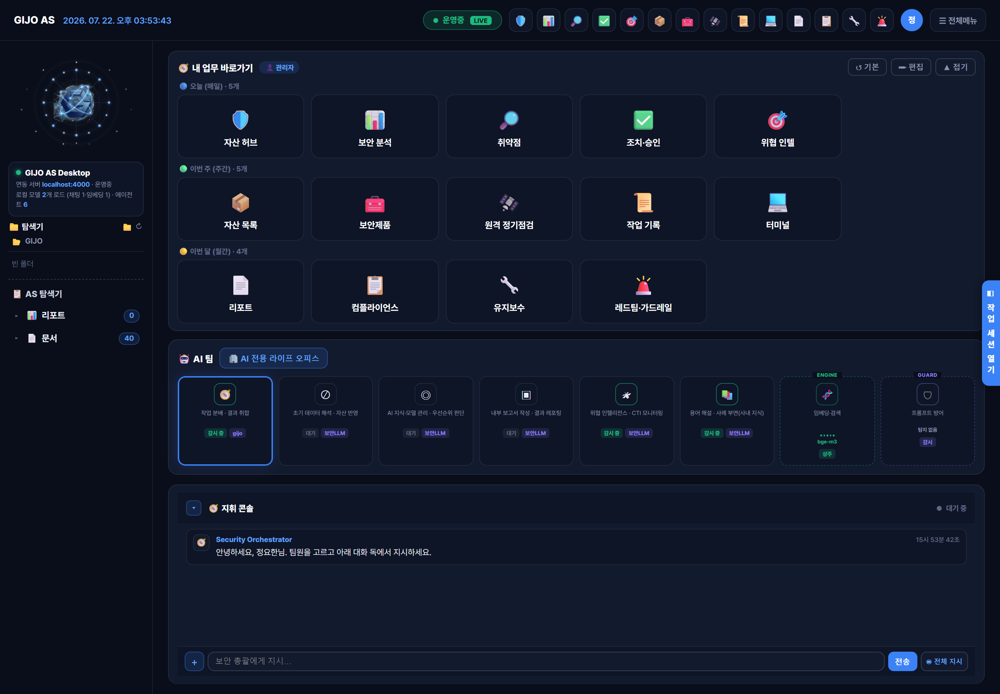
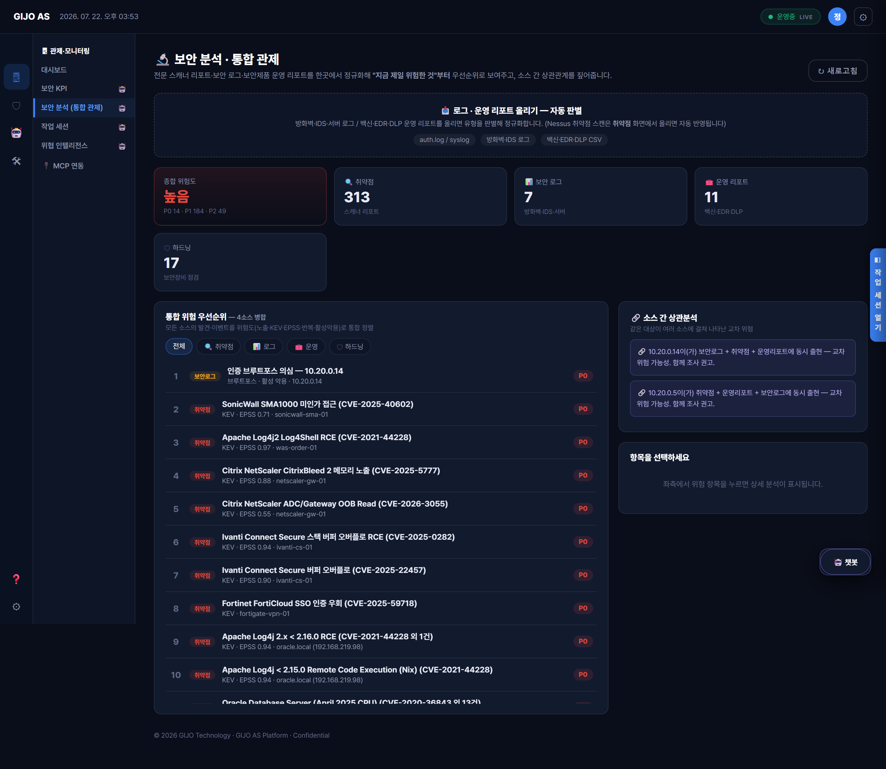

# GIJO AS — 제품 소개 & 시장 경쟁 분석

> **한 명의 보안담당자가 여러 명 몫을 해내도록.**
> 흩어진 보안 정보를 AI 에이전트가 자동으로 엮어 처리하는 **완전 온프레미스** 보안 운영 플랫폼.

*본 문서의 시장·경쟁 정보는 2026년 7월 공개 자료 기준 조사입니다(출처는 문서 끝에 명시). 제품 기능·수치는 실제 구동해 검증한 실측 기준입니다(서버 자동화 테스트 860개 통과).*

---

## 1. 한 줄 정의

**GIJO AS**는 AI 자산·취약점·위협 인텔·보안장비 운영·컴플라이언스를 **하나의 폐쇄망 플랫폼**에서 다루고, 보안 특화 **Agent AI 팀 + 로컬 LLM**이 담당자의 업무를 대신 수행·상관분석하는 **온프레미스 보안 운영(SecOps) 통합 제품**입니다.

핵심은 세 가지입니다.
- **수렴(Convergence)** — AI-BOM·취약점관리·LLM 보안·SOC 분석·장비 하드닝을 한곳에.
- **자동 상관(Correlation)** — "이 위협이 우리 어느 자산·서비스에?"를 사람 대신 엮음.
- **완전 온프레미스(Sovereignty)** — 데이터도 AI도 조직 경계를 벗어나지 않음.


---

## 2. 보안담당자 업무 자동화 — 하루가 이렇게 달라집니다

GIJO AS의 출발점은 **"인원이 부족한 보안담당자가 하던 반복 업무를 AI가 대신한다"**입니다. 대시보드를 하나 더 주는 게 아니라, **자연어로 지시하면 보안 에이전트 팀이 실제로 처리**합니다.

### 담당자가 매일 하던 일 → GIJO AS가 대신

| 담당자의 수작업(기존) | GIJO AS 자동화 | 자연어 지시 예시 |
|---|---|---|
| 스캐너 리포트 수백 건을 눈으로 정렬해 "뭐부터?" 판단 | 전 자산 가로질러 KEV·EPSS·VPR로 우선순위 자동 산정 | *"오늘 뭐부터 조치해야 해?"* |
| 취약점마다 담당자·기한을 수기 배정 | 담당자·기한 자동 배정(결재판 승인 후 실행) | *"가장 급한 취약점 담당자랑 기한 배정해줘"* |
| 아침마다 상황을 손으로 취합 | 오늘의 보안 브리핑 즉석 생성 | *"오늘 브리핑 해줘"* |
| CTI 위협이 어느 자산·서비스에 영향인지 눈으로 대조 | 위협→자산→서비스 자동 상관 | *"이 위협 우리 어느 자산에 영향?"* |
| 주간·임원 보고서를 매번 손으로 작성 | 보고서 자동 생성(DOCX/PDF) | *"주간 보안 리포트 작성해줘"* |
| 보안장비 설정을 수동 점검 | CCE/KISA 하드닝 점검 실행·리포트 | *"이 서버 하드닝 점검해줘"* |
| "조치했다는데 실제로 고쳐졌나?" 수동 재확인 | 재스캔으로 해결 자동 검증(closed-loop) | (조치 완료 보고 → 재스캔 → 완료 자동 확정) |

> 위 지시문은 **실제 제품에서 동작하는 명령**입니다(라우팅 정확도 실측·검증). 비슷한 표현이 와도 같은 기능으로 처리됩니다.

### 한 문장 지시 → 여러 단계 자동 수행 (복합 지시)
*"이 자산 스캔하고 우선순위 분석해서 리포트까지"* 처럼 여러 작업을 한 문장으로 지시하면, 오케스트레이터가 **스캔 → 분석 → 리포트**를 순서대로 자동 실행하고 각 단계를 실시간 협업 로그로 보여줍니다.

> **효과:** 여러 콘솔을 오가며 하던 반복 업무가 **"지시 한 줄"**로 줄어듭니다. 1인 담당자가 여러 명 몫을 해내는 핵심 지렛대입니다.

---

## 3. 왜 지금 이 제품인가

기업 보안팀은 **항상 인원이 부족**한데, 관리 대상은 계속 늘어납니다. 특히 2024~2026년 들어 **AI 자산(모델·에이전트·공급망)**까지 관리 범위에 들어오면서, 다뤄야 할 도구가 폭증했습니다.

시장은 이 수요에 **여러 갈래의 전문 제품**으로 답했습니다 — AI 보안 태세 관리(AI-SPM), LLM 런타임 방화벽, 모델 스캐닝, AI 레드팀 등. 하지만 대부분은 **① 클라우드 SaaS 전제**이고 **② 한 가지 문제만 푸는 포인트 솔루션**이며 **③ 자사 클라우드로 데이터를 보내** 분석합니다.

**GIJO AS는 이 세 가지 전제를 정확히 뒤집습니다** — 온프레미스, 수렴형, 데이터 무유출.

---

## 4. AI 보안 시장 지형 — 5대 카테고리 분류

인터넷 공개 자료 기준으로, 현재 AI/보안 운영 제품군은 크게 다섯 갈래입니다. 각 카테고리의 대표 제품과 GIJO AS의 대응 기능을 함께 표기합니다.

### ① AI-SPM (AI 보안 태세 관리)
클라우드에 흩어진 AI 서비스·모델·학습데이터를 발견·평가·거버넌스.

| 대표 제품 | 성격 |
|---|---|
| **Wiz AI-SPM** | 멀티클라우드(AWS/Azure/GCP) 에이전트리스 스캔, 공격경로 그래프 |
| **Palo Alto Prisma Cloud** | CNAPP 내장 AI-SPM. Protect AI 인수로 모델 스캐닝·ML 공급망 강화 |
| **Orca Security** | 에이전트리스 사이드스캔 + AI-BOM, 클라우드 리소스와 자동 상관 |
| **CrowdStrike / Cyera / Varonis** | 각각 엔드포인트·데이터·거버넌스 관점 AI-SPM |

> **GIJO AS 대응:** AI 자산 인벤토리 + **AI-BOM(CycloneDX ML-BOM)** + 자산↔위협↔서비스 상관. 단, **클라우드 CNAPP이 아니라 온프레미스 자산** 대상.

### ② LLM 런타임 보안 / AI 방화벽 / 가드레일
운영 중인 LLM 앱의 입력·출력을 실시간 검사 — 프롬프트 인젝션·탈옥·PII 유출 차단.

| 대표 제품 | 성격 |
|---|---|
| **Lakera Guard** | 런타임 LLM 방화벽. 프롬프트 인젝션 98%+ 탐지, 저지연. **Check Point 인수(2025.9)** |
| **Prompt Security** | GenAI 런타임 보호 + 섀도우 AI 발견. **SentinelOne 인수** |
| **Protect AI LLM Guard** | 오픈소스(MIT) 자체호스팅 입출력 스캐너. **Palo Alto 인수** |
| **NeuralTrust / CalypsoAI / WitnessAI** | LLM 방화벽·AI 게이트웨이 |

> **GIJO AS 대응:** 런타임 **가드레일**(dispatch 통합 flag/block) + **자동 레드팀**(카나리 페이로드). 온프레미스에서 자체 실행.

### ③ AI-BOM / ML 공급망 / 모델 스캐닝
모델 파일·데이터셋·의존성의 구성·출처·악성코드(pickle 익스플로잇 등)를 검사.

| 대표 제품 | 성격 |
|---|---|
| **HiddenLayer AISec** | ML 모델 보안 전문. 모델 스캐닝(35+ 포맷) + **AI-BOM 자동 생성** + 레드팀 |
| **Protect AI ModelScan** | 오픈소스 모델 스캐너(PyTorch·GGUF·pickle 등) |
| **Endor Labs** | AI 구성요소 인벤토리 + 공급망·라이선스 컴플라이언스 |

> **GIJO AS 대응:** **AI-BOM + ModelScan 통합 + 거버넌스 연계**(AI-BOM→KISA 위협→OWASP/NIST/MITRE→대응현황). 제품의 **차별 플래그십 기능**.


### ④ AI 레드팀 / 적대적 테스트
모델·에이전트의 견고성을 공격 시나리오로 검증.

| 대표 제품 | 성격 |
|---|---|
| **Lakera / HiddenLayer / Mindgard** | 상용 AI 레드팀 |
| **Garak (오픈소스)** | LLM 취약점 스캐너 |

> **GIJO AS 대응:** 자동 레드팀(14 카나리 페이로드) + AI-BOM 자산 견고성 점수. 온프레미스 자체 실행.



### ⑤ 온프레미스 / 에어갭 / 주권형 AI
데이터·모델이 조직 경계를 벗어나지 않는 폐쇄형 배포.

| 대표 제품 | 성격 |
|---|---|
| **SentinelOne (온프렘 AI 보안, 2026.3)** | 엔드포인트 보호를 클라우드 의존 없이 |
| **Aleph Alpha PhariaAI** | EU 에어갭 LLM 플랫폼(독일 정부 분류환경) |
| **LightOn Paradigm / IBM Defense Model** | 사설·에어갭 LLM |

> **GIJO AS의 본진:** 이 카테고리에 **보안 운영 플랫폼 전체**를 올린 드문 사례. 위 제품들은 "엔드포인트" 또는 "LLM 런타임"에 국한.

---

## 5. GIJO AS의 포지셔닝 — "수렴형 온프레미스"

위 다섯 갈래를 지형도에 놓으면, 경쟁 제품 대부분은 **한 축의 포인트 솔루션 + 클라우드 SaaS**입니다.

```
                    클라우드 SaaS
                         ▲
   Wiz · Orca · Palo Alto AI-SPM      Lakera · Prompt Security
   (AI-SPM, 멀티클라우드)              (LLM 런타임, 포인트)
                         │
  단일 기능 ◀────────────┼────────────▶ 통합(수렴)
                         │
        HiddenLayer                  ★ GIJO AS ★
        (모델 보안, 포인트)          (AI-BOM+VM+LLM보안+SOC+
                         │            하드닝을 한곳에)
                         ▼
                    온프레미스 / 에어갭
```

**GIJO AS는 우측 하단** — "여러 축을 수렴한 통합 제품"이면서 동시에 "완전 온프레미스"인, 경쟁 제품이 비어 있는 사분면에 있습니다.

---

## 6. 경쟁 비교표

| 항목 | GIJO AS | 클라우드 AI-SPM (Wiz·Orca·Palo Alto) | LLM 방화벽 (Lakera·Prompt Sec) | 모델 보안 (HiddenLayer) |
|---|---|---|---|---|
| **배포** | ✅ 완전 온프레미스/에어갭 | 클라우드 SaaS 중심 | SaaS/API(자체호스팅 일부) | CI/CD·클라우드 |
| **데이터 유출** | ✅ 없음(폐쇄망 완결) | 자사 클라우드로 전송 | 프롬프트를 API로 전송(대개) | 스캔 결과 클라우드 |
| **분석용 AI** | ✅ 로컬 GPU 오픈모델(BYOM) | 벤더 클라우드 | 벤더 클라우드 | 벤더 클라우드 |
| **AI-BOM** | ✅ 생성+거버넌스 연계 | 일부(Orca 등) | ✕ | ✅ 자동생성 |
| **전통 취약점관리(VM)** | ✅ 통합(KEV/EPSS/VPR) | 인접 | ✕ | ✕ |
| **LLM 가드레일/레드팀** | ✅ 내장 | ✕/일부 | ✅ (전문) | ✅ |
| **보안장비 하드닝(CCE/CIS)** | ✅ 국내 KISA U-시리즈+CIS | ✕ | ✕ | ✕ |
| **SOC 통합 분석(로그·리포트)** | ✅ 통합 관제 허브 | 일부 | ✕ | ✕ |
| **Agent AI 자동 업무수행** | ✅ 자연어 지시→에이전트 팀 | ✕(대시보드) | ✕ | ✕ |
| **국내(한국어·KISA·규제)** | ✅ 특화 | 영어·글로벌 우선 | 영어 우선 | 영어 우선 |

> LLM 방화벽·모델 보안 전문 제품은 **각 축에서 GIJO AS보다 깊습니다**(예: Lakera의 프롬프트 인젝션 탐지 정확도, HiddenLayer의 35+ 모델 포맷). GIJO AS의 값은 **깊이 경쟁이 아니라 "온프레미스에서 여러 축을 하나로 엮는 수렴 + 자동화"**에 있습니다.

---

## 7. 핵심 강점 6가지

### ① 완전 온프레미스 — 데이터도 AI도 나가지 않음
경쟁 제품 대부분은 클라우드 SaaS이며, 분석을 위해 데이터(심지어 프롬프트 원문)를 자사 클라우드로 보냅니다. GIJO AS는 **분석하는 AI 자체가 로컬 GPU에서 도는 오픈모델**이라, 폐쇄망·에어갭에서 완결됩니다.
> **왜 중요한가:** 금융·공공·방산 등 데이터 반출이 금지된 환경에서, "AI 보안을 쓰려면 데이터를 밖으로 보내야 하는" 역설을 없앱니다.

### ② 수렴형 통합 — 흩어진 축을 하나로
AI-SPM·LLM 방화벽·모델 스캐닝·전통 VM·장비 하드닝·SOC 분석이 **각각 다른 벤더 제품**인 시장에서, GIJO AS는 이들을 **하나의 플랫폼에서 상관**시킵니다.
> **왜 중요한가:** 인원이 부족한 팀은 5개 콘솔을 오갈 여력이 없습니다. "AI-BOM→위협→자산→서비스→대응"이 한 화면에서 이어집니다.

### ③ Import-not-Vendor-API — 개방형 LLM(BYOM)
OpenAI·Anthropic API에 종속되지 않고, **오픈소스 모델(Qwen·Lily 등)을 가져와 자체 합성(SLERP)·미세조정**해 운영합니다.
> **왜 중요한가:** 벤더 종속·API 비용·데이터 전송 없이, 고객이 모델 주권을 갖습니다. 폐쇄망에서도 최신 오픈모델을 갱신해 씁니다.

### ④ Agent AI — 대시보드가 아니라 "일하는 팀"
경쟁 제품이 담당자에게 **대시보드**를 주는 반면, GIJO AS는 **자연어 지시를 받아 협업 처리하는 보안 에이전트 팀**을 줍니다(오케스트레이터·스캔·분석·리포트 등).
> **왜 중요한가:** "이 취약점 담당자 배정하고 조치 브리핑 만들어줘"를 사람이 아니라 AI가 수행합니다. 1인 담당자의 실질 처리량이 늘어납니다.



### ⑤ 국내 특화 — KISA·한국어·규제 정합
국내 **CCE/KISA U-시리즈 하드닝 점검**, 한국어 응답, 국내 데이터 주권 규제에 맞는 온프레미스. 글로벌 벤더는 영어·클라우드 우선입니다.
> **왜 중요한가:** 국내 공공·금융 컴플라이언스와 언어·규제 정합성이 곧 도입 가능성입니다.

### ⑥ 조치 생애주기 · 거버넌스 · 감사
취약점을 **미검토→진행중(담당 이원화)→검증(재스캔)→완료 / 반려(사유·승인자 보존)**의 closed-loop로 관리하고, 모든 행위를 감사 로그로 남깁니다. 지식은 RAG+온톨로지, 학습은 폐쇄형 루프로 축적됩니다.
> **왜 중요한가:** "스캔은 많은데 실제로 고쳐졌는지 모르는" 문제를 재스캔 검증으로 닫습니다(NIST VM 생애주기·closed-loop 모범사례 정합).


---

## 8. 실제 제품 화면 (실측 데이터)

*아래는 실제 운영서버 응답으로 렌더링한 제품 화면입니다 — 목업이 아닙니다.*

**통합 관제(보안 분석) — 취약점·보안로그·운영리포트·하드닝 4소스 정규화·우선순위·상관분석**


**보안 KPI 대시보드 — 종합 보안태세 점수 + 임원 헤드라인 + MTTR (SOC 모범사례)**


**취약 자산 관리 — Nessus 정규화·KEV/EPSS/VPR 우선순위·생애주기**


**AI 자산 서비스 영향도 — 위협→자산→업무 서비스 롤업(자동 상관)**


**컴플라이언스 — KISA 위협 21항목 대응 현황(거버넌스)**


**에이전트 AI — 보안 특화 에이전트 팀 + 자연어 지시 + 추천 로컬 LLM**


---

## 9. 정직한 경계 (과장하지 않기)

제품의 신뢰를 위해, GIJO AS가 **하지 않는/약한** 영역도 밝힙니다.

- **멀티클라우드 CNAPP이 아님** — AWS/Azure/GCP를 가로지르는 에이전트리스 클라우드 스캔은 Wiz·Orca의 영역입니다. GIJO AS는 온프레미스 자산이 주 대상입니다.
- **단일 축 깊이는 전문 제품이 더 깊음** — 프롬프트 인젝션 탐지 정밀도(Lakera), 모델 포맷 커버리지(HiddenLayer)는 전문 벤더가 앞섭니다. GIJO AS의 값은 수렴·온프레미스·자동화입니다.
- **탐지 모델은 7~8B 오픈모델** — 벤더의 대형 전용 탐지모델 대비 규모가 작습니다(온프레미스 GPU 제약의 교환). 대신 결정적 규칙·가드레일로 흔들림을 보완합니다.
- **성숙도/레퍼런스** — 글로벌 대형 벤더 대비 배포 규모·레퍼런스는 초기 단계입니다.

> 이 경계는 약점이 아니라 **설계 선택의 교환**입니다 — "온프레미스에서, 인원이 부족한 팀이, 여러 축을 하나로" 라는 목표를 위해 클라우드 규모·단일축 깊이를 일부 포기했습니다.

---

## 10. 한 문단 요약

> AI 보안 시장은 **클라우드 SaaS · 단일 기능 포인트 솔루션**으로 채워져 있고, 2025~2026년 급속히 대형 벤더로 통합(Lakera→Check Point, Prompt Security·Prompt→SentinelOne, Protect AI→Palo Alto)되고 있습니다. **GIJO AS는 그 반대편** — 데이터도 AI도 나가지 않는 **완전 온프레미스**에서, AI-BOM·취약점관리·LLM 보안·SOC 분석·장비 하드닝을 **하나로 수렴**하고, **Agent AI 팀**이 인원 부족한 보안팀의 업무를 대신 수행합니다. 경쟁 제품이 비어 있는 "수렴형 온프레미스" 사분면이 GIJO AS의 자리입니다.

---

## 출처 (2026년 7월 조사)

- AI-SPM 벤더 지형: Orca Security, Guptadeepak, Aurascape (AI Security Landscape 2026)
- LLM 런타임/가드레일: Galileo, Lakera Docs(Check Point), WAFPlanet(AI/LLM Firewall Vendor Map 2026), Guptadeepak(AI Threat Detection Tools 2026)
- AI-BOM/모델 스캐닝: HiddenLayer(AI Supply Chain Security, Model Scanning), Endor Labs, AppScale(AI Supply Chain Security 2026)
- 온프레미스/주권형: SentinelOne(온프렘 AI 보안 보도자료 2026.3), Aleph Alpha PhariaAI, Thoughtminds(Sovereign AI)

*경쟁 제품명·인수 정보는 공개 자료 기준이며, 세부는 각 벤더 최신 발표로 재확인을 권합니다. 본 문서는 GIJO AS 포지셔닝 설명 목적입니다.*
