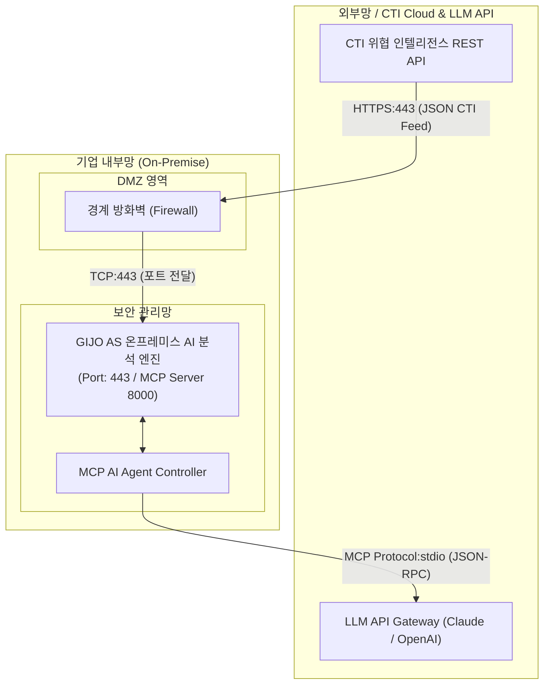

# [보안 솔루션 규격 및 매뉴얼] GIJO AS (지아이조테크놀로지 [국산])

- **솔루션 분류**: 보안운영 자동화 플랫폼(기업 설치형) (국산)
- **공급사 / 제조사**: 지아이조테크놀로지 [국산]
- **도입 대상 및 주무 부서**: 보안담당자의 리소스 절감
- **솔루션 핵심 역할**: 보안담당자 업무 자동화
- **표준 조달/도입 단가**: ₩45,000,000
- **ISMS-P 인증 통제항목**: 2.12 신기술 및 AI 보안통제

---

## 1. 솔루션 개요 (Overview)
흩어진 보안 로그와 CTI 위협을 폐쇄망 AI 에이전트가 자동으로 상관분석해 주는 온프레미스 보안 운영 플랫폼

## 2. 도입 목적 및 필요성 (Purpose)
분산된 보안 운영 정보 및 AI 자산 통합 통제
- CTI 외부 위협 텍스트와 사내 자산 식별자 간 자동 대조 및 매칭
- 취약점 장비 스캔 결과, 보안 로그, EDR/DLP 운영 리포트의 통합 정규화
- 자사 운영 AI 자산 식별(AI-BOM) 및 실시간 가드레일/레드팀 점검
- 보안장비 하드닝 및 원격 SSH 정기 점검 관리

## 3. 핵심 기능 (Key Features)
AI툴 관리
- AI자산을 구성하는 5개의 레이어(모델, 데이터, 프롬프트, 도구, 인프라)를 프로파일링하여 CycloneDX ML-BOM 표준으로 제공

오케스트레이션(상관관계 분석)
- AI-SBOM으로 AI자산 식별 뿐만아니라 취약점 스캔, 외부CTI위협정보, 보안로그, 점검기록 등 분산된 보안 데이터를 연결하여 상관관계 분석

기반 취약점 생애주기 관리
- 취약점 결과 XML데이터 중복 제거 및 CISA KEV/EPSS/VPR 기반 최우선 조치 수립

## 4. 특장점 및 차별화 요소 (Highlights)
폐쇄망에서 사용가능한 아키텍처
-외부 API 호출 없이 폐쇄망환경에서 동작하여 로그 및 민감정보가 외부로 나가지 않는 구조

가드레일
- 쓰기 작업 시 결재판(Approval Board)을 통한 최종 승인 후 실행 및 위변조 불가 감사 로그(Audit Vault) 보존

## 5. 컴플라이언스 및 법적 규제 준수 (Regulation)
금융보안원 「인공지능 보안 안내서」
- 개발·도입하는 AI 모델과 SW의 구성품(오픈소스 등) 목록을 식별하고 취약점을 상시 모니터링해야 함.

금융·공공권 망분리 규제 및 개인정보보호법
- 외부 AI 서비스 사용 시 사내 기밀 유출 금지 조항 준수

## 6. 도입 기대 효과 (Expected Effects)
보안담당자의 리소스 절감
- 보유 자산과 CTI 위협/취약점을 수작업 대조하던 수십 시간의 분석 공수를 자동화하여 핵심 위험 요인만 즉시 조치

## 7. 실무 운영 매뉴얼 & 점검 절차 (Operation Manual)
- **일일 점검**: 엔진 데몬 프로세스 상태 확인, 관리 콘솔 대시보드 경보(Alert) 로그 확인.
- **주간 점검**: 정책 위반 및 차단 건수 통계 추출, 에이전트/노드 버전 무결성 점검.
- **월간 점검**: 관리자 접근 감사 로그 백업, 암호화 키 및 만료 주기 점검, ISMS-P 증적 자료 추출.
- **장애 대응 런북**:
  1. 관리 콘솔 접속 불가 시 데몬 서비스(Service / Systemd) 상태 확인 및 프로세스 재기동.
  2. 네트워크 차단 지연 발생 시 Bypass 모드 전환 및 세션 테이블 임계치 확인.
  3. 라이선스 만료 경고 시 조달/유지보수 담당 엔지니어 긴급 기술지원 티켓 인계.

## 9. 표준 권장 아키텍처 다이어그램

