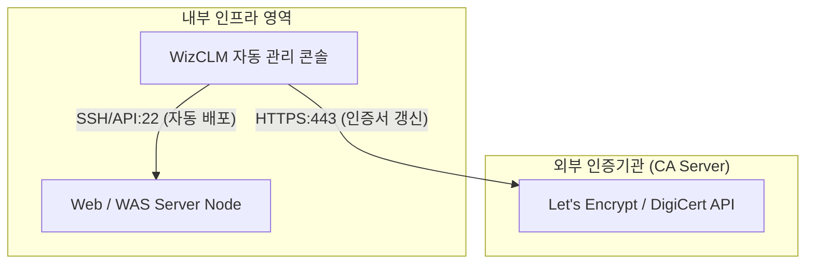

# [보안 솔루션 규격 및 매뉴얼] WizCLM (지아이조테크놀로지 [단독 총판])

- **솔루션 분류**: 인증서 라이프사이클 자동 관리 솔루션 (CLM) (국산)
- **공급사 / 제조사**: 지아이조테크놀로지 [단독 총판]
- **도입 대상 및 주무 부서**: Web, WAS, DB, API, 로드밸런서, 웹방화벽(WAF) 등에 설치된 SSL/TLS 및 사설 인증서
- **솔루션 핵심 역할**: 인증서 현황 탐지, 자동 발급/갱신, 배포 및 설치, 만료 모니터링/ MCP 연동지원 /무료인증서 제공
- **표준 조달/도입 단가**: ₩28,000,000
- **ISMS-P 인증 통제항목**: 2.6 암호키 및 인증서 관리

---

## 1. 솔루션 개요 (Overview)
글로벌 보안 규정 변화로 단축되는 SSL/TLS 인증서의 유효기간에 대응하여, 사내 전체 인증서의 발급, 갱신, 배포 업무를 전면 자동화하여 만료 사고를 방어하는 시스템

## 2. 도입 목적 및 필요성 (Purpose)
인증서 만료로 인한 서비스 중단 사고 차단
- 운영 중인 모든 웹서버 및 인프라의 SSL/TLS 인증서  - 단축되는 유효기간에 맞춘 상시 자동 발급 및 갱신
- 수동 관리에 따른 만료 임박 인적 오류(실수) 해소  - 사내 분산 배포된 인증서 사각지대 전수 파악

## 3. 핵심 기능 (Key Features)
인증서 발급 및 갱신 자동화
- 기존 수작업 프로세스를 API 기반 스케줄링 자동화  유기적인 장애 알림 체계 연동
- Slack, Teams, Jira와 직접 연동되어 만료 임박 시 알림  만료 사고 원천 차단 기능
- 만료 발생 시 자동으로 무료 인증서 대체 가동  통합 대시보드 스캔 가시성
- 사내 모든 웹 도메인의 유효기간 실시간 스캔 가시화

## 4. 특장점 및 차별화 요소 (Highlights)
예기치 못한 만료 시 서비스 중단 예비
- 단순 갱신 예정일 알림 수준에 그치는 오픈소스 방식과 달리, 인적 실수로 만료 사고 발생 시 '임시 무료 인증서 자동 발급 및 대체 가동'을 통해 서비스 마비를 물리적으로 방어하는 독보적 차별성 보유

## 5. 컴플라이언스 및 법적 규제 준수 (Regulation)
전자금융거래 안전성 확보 지침 및 ISMS-P
- 암호화 통신(SSL/TLS)의 유효성 유지 의무 준수
- 2029년 전 세계 인증서 유효기간 47일 단축 정책 선제 대응

## 6. 도입 기대 효과 (Expected Effects)
인적 오류 제로화를 통한 대고객 비즈니스 연속성 사수
- 인증서 만료로 인해 금융 앱, 웹 서비스가 일시에 마비되고 기업 신뢰도가 실추되는 대형 무중단 장애 리스크 영구 소멸
- 매달 반복되는 인증서 관리 공수를 자동화하여 보안팀 리소스 절감

## 7. 실무 운영 매뉴얼 & 점검 절차 (Operation Manual)
- **일일 점검**: 엔진 데몬 프로세스 상태 확인, 관리 콘솔 대시보드 경보(Alert) 로그 확인.
- **주간 점검**: 정책 위반 및 차단 건수 통계 추출, 에이전트/노드 버전 무결성 점검.
- **월간 점검**: 관리자 접근 감사 로그 백업, 암호화 키 및 만료 주기 점검, ISMS-P 증적 자료 추출.
- **장애 대응 런북**:
  1. 관리 콘솔 접속 불가 시 데몬 서비스(Service / Systemd) 상태 확인 및 프로세스 재기동.
  2. 네트워크 차단 지연 발생 시 Bypass 모드 전환 및 세션 테이블 임계치 확인.
  3. 라이선스 만료 경고 시 조달/유지보수 담당 엔지니어 긴급 기술지원 티켓 인계.

## 9. 표준 권장 아키텍처 다이어그램

