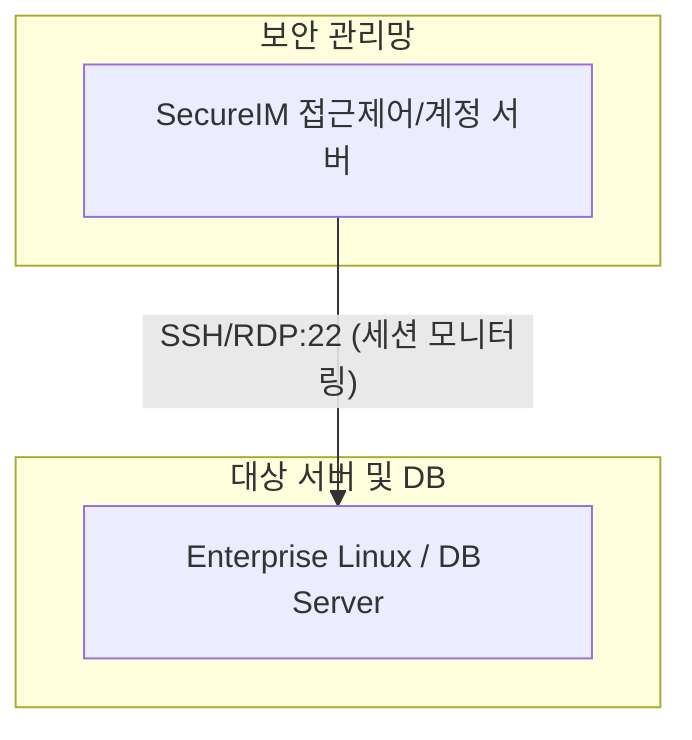

# [보안 솔루션 규격 및 매뉴얼] SecureIM (지코소프트 [국산])

- **솔루션 분류**: 통합 서버 접근제어 / 계정관리 솔루션 (국산)
- **공급사 / 제조사**: 지코소프트 [국산]
- **도입 대상 및 주무 부서**: 사내 사용자 PC(Windows, macOS), 개인정보 및 기업 핵심 기술 문서
- **솔루션 핵심 역할**: 개인정보 및 민감 데이터 탐지, 매체 제어, 출력물 관리, 네트워크 유출 차단
- **표준 조달/도입 단가**: ₩32,000,000
- **ISMS-P 인증 통제항목**: 2.4 서버 접근통제 및 계정관리

---

## 1. 솔루션 개요 (Overview)
사내 서버 및 인프라 시스템의 계정 생성·변경·삭제 전체 수명주기를 자동화하고, 공유/관리자(특권) 계정의 패스워드 자동 변경 및 접근 통제·감사를 수행하는 시스템

## 2. 도입 목적 및 필요성 (Purpose)
특권 계정 통제 및 우회 접속 감사
- 서버, 네트워크, 보안장비, DB 계정 관리
- 관리자(어드민) 및 특권 계정 라이프사이클 자동화
- 패스워드의 주기적·강제적 자동 무작위 변경
- 서버 접근 권한 통제 및 실시간 작업 행위 감사

## 3. 핵심 기능 (Key Features)
계정 및 패스워드 자동화 관리 (Secure IM/PM)
- 특권 계정 자동 생성·삭제 및 일괄 패스워드 변경  강력한 서버 접근제어 및 감사 (Secure Audit)
- 비인가 접근 차단 및 세션별 명령어 통제·로깅  광범위한 인프라 연동 지원
- 서버 외 네트워크 장비, 보안 장비, DB 일괄 연계  비용 절감형 모듈 라인업
- 필요 시 패스워드 전용(Secure PM) 모듈 분리 공급 가능

## 4. 특장점 및 차별화 요소 (Highlights)
접근제어와 계정관리 통합제공
  - 개별 도구로 쪼개어 사야 했던 접근제어와 계정관리(패스워드)를 단일 솔루션으로 통합 운영 가능해 비용 절감 우수
- 국내 1위 제품(넷엔드)의 기능을 커버하면서 특정 보안 아키텍처 항목에서는 더욱 유연한 탐지력 증명

## 5. 컴플라이언스 및 법적 규제 준수 (Regulation)
전자금융감독규정, ISMS-P 및 내부통제 규정
- 인프라 시스템 접근 통제, 권한 부여 관리 의무 준수
- 관리자 특권 계정의 패스워드 복잡도 및 주기적 변경 지침 준수
- 접근 행위 기록 상시 보존 및 규정 보고서 아웃풋

## 6. 도입 기대 효과 (Expected Effects)
내부자 우회 위협 방어 및 컴플라이언스 인프라 확립
- 공유/퇴사자 계정 오남용 및 불법적인 서버 명령어 실행을 원천 차단하여 인프라 무결성 유지
- 조달청 등록 제품으로 신속하고 검증된 체계의 전사 내부 통제 아키텍처 이행

## 7. 실무 운영 매뉴얼 & 점검 절차 (Operation Manual)
- **일일 점검**: 엔진 데몬 프로세스 상태 확인, 관리 콘솔 대시보드 경보(Alert) 로그 확인.
- **주간 점검**: 정책 위반 및 차단 건수 통계 추출, 에이전트/노드 버전 무결성 점검.
- **월간 점검**: 관리자 접근 감사 로그 백업, 암호화 키 및 만료 주기 점검, ISMS-P 증적 자료 추출.
- **장애 대응 런북**:
  1. 관리 콘솔 접속 불가 시 데몬 서비스(Service / Systemd) 상태 확인 및 프로세스 재기동.
  2. 네트워크 차단 지연 발생 시 Bypass 모드 전환 및 세션 테이블 임계치 확인.
  3. 라이선스 만료 경고 시 조달/유지보수 담당 엔지니어 긴급 기술지원 티켓 인계.

## 9. 표준 권장 아키텍처 다이어그램

