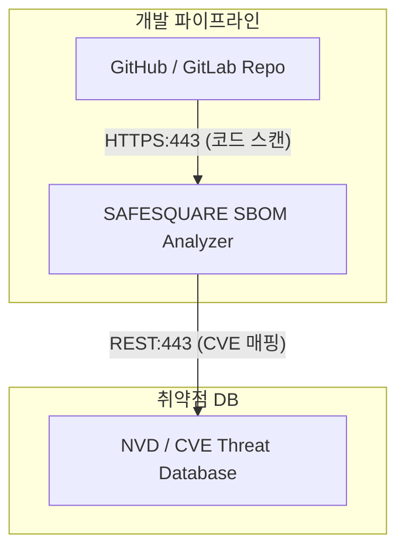

# [보안 솔루션 규격 및 매뉴얼] SAFESQUARE SBOM (NSHC [국산])

- **솔루션 분류**: SCA / SW Supply Chain Security (국산)
- **공급사 / 제조사**: NSHC [국산]
- **도입 대상 및 주무 부서**: 소스코드, 오픈소스 라이브러리, 3rd-party 모듈 및 바이너리
- **솔루션 핵심 역할**: SBOM (Software Bill of Materials) 자동 생성, 오픈소스 취약점(CVE) 탐지 및 라이선스 검증
- **표준 조달/도입 단가**: ₩25,000,000
- **ISMS-P 인증 통제항목**: 2.7 개발 보안 및 오픈소스 점검

---

## 1. 솔루션 개요 (Overview)
오픈소스 및 AI 모델 내 구성품 목록(SBOM)을 추출하고 취약점을 상시 모니터링해주는 라이브러리 검증 시스템

## 2. 도입 목적 및 필요성 (Purpose)
AI모델 및 SW(AI모델과 SW를 써도 안전한지 확인)
- 오픈소스 AI모델 내에 숨겨진 백도어 탐지
- 공급망 취약점 추적

## 3. 핵심 기능 (Key Features)
풀스택 SBOM 자동 생성 및 분석
- AI 모델 파일, 컨테이너(Docker 이미지), 소스코드, 오픈소스 패키지의 의존성 구조를 명세서(SBOM)로 자동 추출

그래프 분석
- 발견된 CVE 취약점이 어떤 핵심 서비스와 연관되어 있는지 인프라(EC2, K8s Pod, DBMS 등) 레벨까지 연결하여 시각화

AI 모델 무결성 정밀 점검
- Hugging Face 등 외부에서 반입되는 AI 모델 파일 내의 숨겨진 백도어, 악성 코드, 포맷 위험 항목 정밀 진단

감사 로그 수집
- 감사로그 수집

## 4. 특장점 및 차별화 요소 (Highlights)
AI 모델 영역까지 확장된 무결성 검증
- 일반적인 오픈소스 SW 진단(SCA) 툴은 AI 모델 파일 내부의 독성 코드나 백도어를 보지 못하지만, SAFESQUARE는 AI 모델 고유의 포맷 위험까지 검증 가능한 솔루션

국내 컴플라이언스 최적화
- 2026년 금융감독원 감독 프레임워크(위험 식별·통제·감시) 및 공급망 보안 가이드라인의 요구사항에 즉시 대응 가능한 맞춤형 증적 리포트 제공

## 5. 컴플라이언스 및 법적 규제 준수 (Regulation)
금융보안원 「인공지능 보안 안내서」
개발·도입하는 AI 모델과 SW의 구성품(오픈소스 등) 목록을 식별하고 취약점을 상시 모니터링해야 함.

-> AI 모델 및 탑재 SW 라이브러리의 컴포넌트를 쪼개어 풀스택 SBOM을 추출하고 취약점 자동 검증 및 명세서 보존.

## 6. 도입 기대 효과 (Expected Effects)
공급망 보안 심의 자동화를 통한 리소스 절감
- 수동으로 진행되던 SW/AI 반입 심의 프로세스를 자동화하여 감사 준비 작업 및 검토 시간을 획기적으로 단축

결함 자재의 사전 차단
- 오염되거나 취약한 외부 AI/SW 부품이 사내 시스템에 유입되기 전 단계에서 원천 차단하여 인프라 청정 상태 유지

## 7. 실무 운영 매뉴얼 & 점검 절차 (Operation Manual)
- **일일 점검**: 엔진 데몬 프로세스 상태 확인, 관리 콘솔 대시보드 경보(Alert) 로그 확인.
- **주간 점검**: 정책 위반 및 차단 건수 통계 추출, 에이전트/노드 버전 무결성 점검.
- **월간 점검**: 관리자 접근 감사 로그 백업, 암호화 키 및 만료 주기 점검, ISMS-P 증적 자료 추출.
- **장애 대응 런북**:
  1. 관리 콘솔 접속 불가 시 데몬 서비스(Service / Systemd) 상태 확인 및 프로세스 재기동.
  2. 네트워크 차단 지연 발생 시 Bypass 모드 전환 및 세션 테이블 임계치 확인.
  3. 라이선스 만료 경고 시 조달/유지보수 담당 엔지니어 긴급 기술지원 티켓 인계.

## 9. 표준 권장 아키텍처 다이어그램

