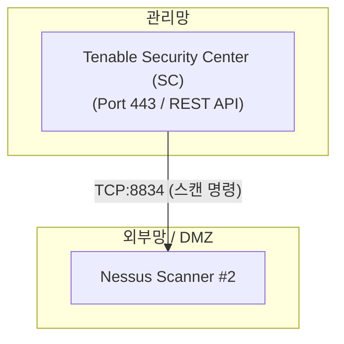

# [보안 솔루션 규격 및 매뉴얼] Tenable ONE (Tenable [외산])

- **솔루션 분류**: 통합 Exposure Management 플랫폼 (외산)
- **공급사 / 제조사**: Tenable [외산]
- **도입 대상 및 주무 부서**: 기업 전사의 레거시 IT 인프라, 클라우드(CNAPP), Active Directory(계정), 외부 노출 자산(ASM) 및 공장·제어시스템(OT) 환경
- **솔루션 핵심 역할**: 공격 경로(Attack Path) 및 실제 비즈니스 영향도 분석
사이버 리스크 지수화(Cyber Exposure Score) 및 경영진 보고서
- **표준 조달/도입 단가**: ₩85,000,000
- **ISMS-P 인증 통제항목**: 2.3 취약점 및 익스포저 관리

---

## 1. 솔루션 개요 (Overview)
전사 IT 인프라, 클라우드, Active Directory, OT 설비의 취약점을 단일 콘솔에서 원격/에이전트 방식으로 수집 분석하는 솔루션

## 2. 도입 목적 및 필요성 (Purpose)
전사 사이버 공격 표면 및 내부 자산 취약점 통합 관리

## 3. 핵심 기능 (Key Features)
종합 자산 식별 및 전방위 취약점 스캔, VPR 점수 제공

## 4. 특장점 및 차별화 요소 (Highlights)
전체 IT자산의 취약점에 대한 통합 관리

## 5. 컴플라이언스 및 법적 규제 준수 (Regulation)
주요 정보통신기반시설 기술적 취약점 분석·평가 및 ISMS-P

## 6. 도입 기대 효과 (Expected Effects)
사이버 침해 사고 선제 예방 및 우선순위 확립

## 7. 실무 운영 매뉴얼 & 점검 절차 (Operation Manual)
- **일일 점검**: 엔진 데몬 프로세스 상태 확인, 관리 콘솔 대시보드 경보(Alert) 로그 확인.
- **주간 점검**: 정책 위반 및 차단 건수 통계 추출, 에이전트/노드 버전 무결성 점검.
- **월간 점검**: 관리자 접근 감사 로그 백업, 암호화 키 및 만료 주기 점검, ISMS-P 증적 자료 추출.
- **장애 대응 런북**:
  1. 관리 콘솔 접속 불가 시 데몬 서비스(Service / Systemd) 상태 확인 및 프로세스 재기동.
  2. 네트워크 차단 지연 발생 시 Bypass 모드 전환 및 세션 테이블 임계치 확인.
  3. 라이선스 만료 경고 시 조달/유지보수 담당 엔지니어 긴급 기술지원 티켓 인계.

## 9. 표준 권장 아키텍처 다이어그램

