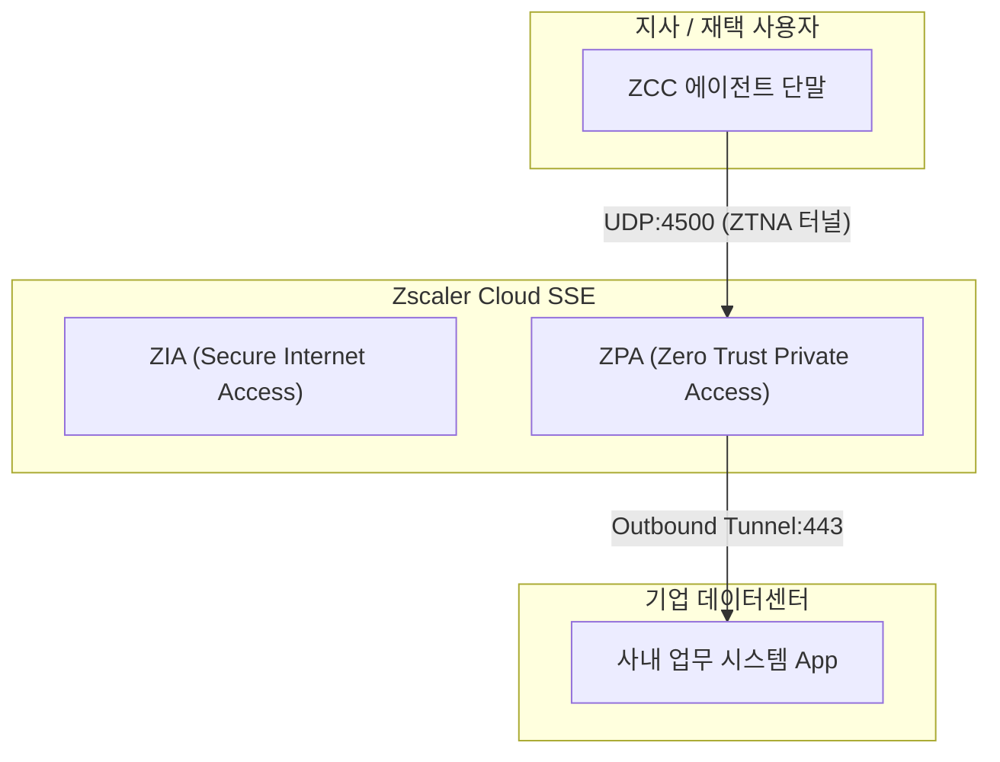

# [보안 솔루션 규격 및 매뉴얼] Zscaler Platform (ZIA / ZPA / ZDX) (Zscaler [외산])

- **솔루션 분류**: 클라우드 네이티브 제로 트러스트 보안 플랫폼 (외산)
- **공급사 / 제조사**: Zscaler [외산]
- **도입 대상 및 주무 부서**: ZIA: SWG / CASB / FWaaS (외부 인터넷 및 SaaS 보안)
ZPA: ZTNA (내부망/사내 시스템 보안 접속, VPN 대체)
ZDX: DEM (디지털 사용자 경험 및 성능 모니터링)
- **솔루션 핵심 역할**: ZIA: 악성코드 차단, URL 필터링, DLP, SaaS 통제
ZPA: 네트워크 접속이 아닌 '특정 앱' 단위 격리 접속
ZDX: 원격근무자/지점의 통신 장애 및 성능 병목 지점 추적
- **표준 조달/도입 단가**: ₩65,000,000
- **ISMS-P 인증 통제항목**: 2.4 제로 트러스트 네트워크 접속

---

## 1. 솔루션 개요 (Overview)
전 세계 자체 데이터센터를 기반으로 사용자와 앱 간 경로를 인바운드 구멍 없이 연결해 주는 제로트러스트 SSE 플랫폼

## 2. 도입 목적 및 필요성 (Purpose)
하이브리드 업무 환경 전체 통제
- 위치 상관없는 안전한 SaaS/인터넷 액세스
- 인바운드가 없는 안전한 내부 사설망 접속
- GenAI 인라인 프롬프트 DLP 통제
- 단말부터 클라우드까지 End-to-End 가시성

## 3. 핵심 기능 (Key Features)
ZIA (Secure Internet/SaaS)
- 데이터 병렬 처리(SSMA) 기반 인터넷 실시간 감시 및 유출 차단
ZPA (Zero Trust Private Access)
- 인바운드 통로가 없는 사설망 Micro-Tunnel 연결 조율

## 4. 특장점 및 차별화 요소 (Highlights)
글로벌 1위 클라우드 제로트러스트 플랫폼

## 5. 컴플라이언스 및 법적 규제 준수 (Regulation)
망분리 완화 규제 가이드북 및 제로 트러스트 준수

## 6. 도입 기대 효과 (Expected Effects)
인프라 구축 비용 감소 및 하이브리드 생산성 극대화

## 7. 실무 운영 매뉴얼 & 점검 절차 (Operation Manual)
- **일일 점검**: 엔진 데몬 프로세스 상태 확인, 관리 콘솔 대시보드 경보(Alert) 로그 확인.
- **주간 점검**: 정책 위반 및 차단 건수 통계 추출, 에이전트/노드 버전 무결성 점검.
- **월간 점검**: 관리자 접근 감사 로그 백업, 암호화 키 및 만료 주기 점검, ISMS-P 증적 자료 추출.
- **장애 대응 런북**:
  1. 관리 콘솔 접속 불가 시 데몬 서비스(Service / Systemd) 상태 확인 및 프로세스 재기동.
  2. 네트워크 차단 지연 발생 시 Bypass 모드 전환 및 세션 테이블 임계치 확인.
  3. 라이선스 만료 경고 시 조달/유지보수 담당 엔지니어 긴급 기술지원 티켓 인계.

## 9. 표준 권장 아키텍처 다이어그램

