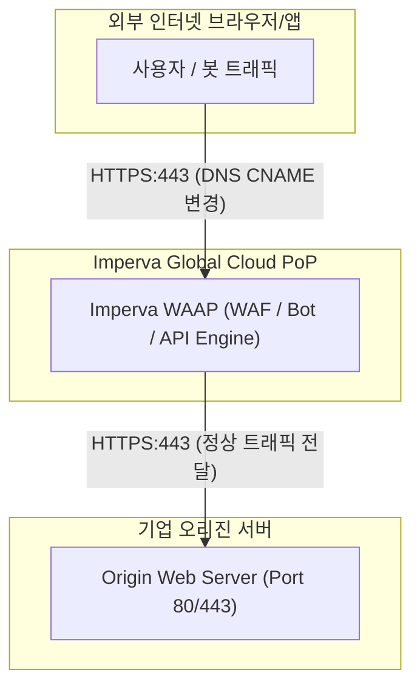

# [보안 솔루션 규격 및 매뉴얼] Imperva WAAP (웹/API/DDoS) (Imperva [외산])

- **솔루션 분류**: 애플리케이션 및 API 통합 보호 플랫폼 (WAAP) (외산)
- **공급사 / 제조사**: Imperva [외산]
- **도입 대상 및 주무 부서**: 자사 운영 웹 서비스 및 인프라
- **솔루션 핵심 역할**: OWASP Top 10 공격및 애플리케이션 계층 위협 차단
OpenAPI 스펙 기반 스키마 검증, shadow API 탐지, API 인가/인증 오남용 방어
Credential Stuffing, 웹 스크래핑, 브루트 포스 등 악성 자동화 봇 트래픽 차단
대용량 트래픽 공격 및 L7 애플리케이션 타깃 서비스 중단 공격 완화(Mitigation)
- **표준 조달/도입 단가**: ₩42,000,000
- **ISMS-P 인증 통제항목**: 2.4 웹/애플리케이션 보호

---

## 1. 솔루션 개요 (Overview)
단일 스택 아키텍처 기반으로 웹 WAF, API 보호, 악성 봇 차단, 테라바이트급 DDoS 방어를 통합 제공하는 Cloud WAAP 솔루션

## 2. 도입 목적 및 필요성 (Purpose)
자사 운영 웹 서비스 및 인프라 사수
- 웹 애플리케이션 OWASP Top 10 공격 방어
- 공개 API 엔드포인트 및 스키마 보호
- 계정 탈취(ATO) 및 지능형 악성 봇 차단
- 테라바이트급 회선 포화 DDoS 방어

## 3. 핵심 기능 (Key Features)
Cloud WAF, API Security, Advanced Bot Protection, DDoS 3초 완화 SLA

## 4. 특장점 및 차별화 요소 (Highlights)
단일 스택 아키텍처 기반 글로벌 WAAP 최강자

## 5. 컴플라이언스 및 법적 규제 준수 (Regulation)
금융보안원 가이드라인 및 기반시설 보호 지침 준수

## 6. 도입 기대 효과 (Expected Effects)
핵심 비즈니스 서비스 가용성 보장 및 무중단 연속성

## 7. 실무 운영 매뉴얼 & 점검 절차 (Operation Manual)
- **일일 점검**: 엔진 데몬 프로세스 상태 확인, 관리 콘솔 대시보드 경보(Alert) 로그 확인.
- **주간 점검**: 정책 위반 및 차단 건수 통계 추출, 에이전트/노드 버전 무결성 점검.
- **월간 점검**: 관리자 접근 감사 로그 백업, 암호화 키 및 만료 주기 점검, ISMS-P 증적 자료 추출.
- **장애 대응 런북**:
  1. 관리 콘솔 접속 불가 시 데몬 서비스(Service / Systemd) 상태 확인 및 프로세스 재기동.
  2. 네트워크 차단 지연 발생 시 Bypass 모드 전환 및 세션 테이블 임계치 확인.
  3. 라이선스 만료 경고 시 조달/유지보수 담당 엔지니어 긴급 기술지원 티켓 인계.

## 9. 표준 권장 아키텍처 다이어그램

