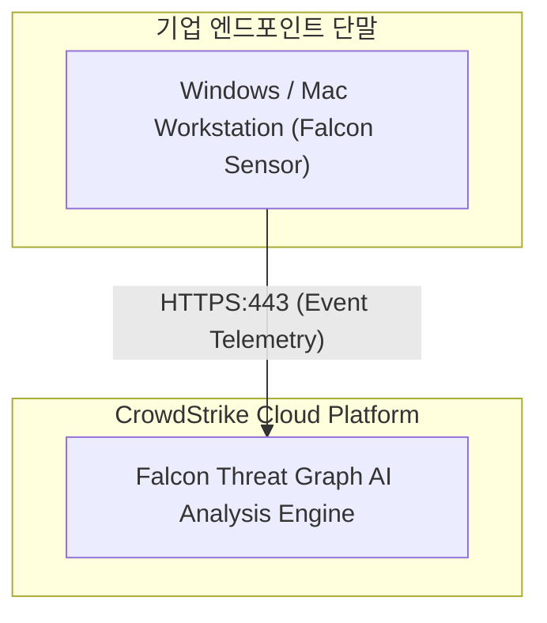

# [보안 솔루션 규격 및 매뉴얼] Falcon Insight (EDR) (CrowdStrike [외산])

- **솔루션 분류**: 엔드포인트 탐지 및 대응 (EDR) / 클라우드 보안 플랫폼 (외산)
- **공급사 / 제조사**: CrowdStrike [외산]
- **도입 대상 및 주무 부서**: PC, 서버, 가상화/클라우드 워크로드, 모바일 등 엔드포인트 전반
- **솔루션 핵심 역할**: 실시간 이벤트 수집, AI 기반 위협 탐지, 레지스트리/프로세스 추적, 격리 및 즉각 대응
- **표준 조달/도입 단가**: ₩24,000,000
- **ISMS-P 인증 통제항목**: 2.8 엔드포인트 악성코드 통제

---

## 1. 솔루션 개요 (Overview)
단일 경량 에이전트로 단말 행위를 실시간 수집하고 클라우드 AI 엔진이 랜섬웨어 및 파일리스 공격을 즉시 격리/대응하는 EDR 솔루션

## 2. 도입 목적 및 필요성 (Purpose)
실시간 고도화 위협 및 비정상 행위 차단
- 단말 내 랜섬웨어, 파일리스(Fileless) 공격 방어
- 시그니처 없는 신종 및 변종 악성코드 탐지
- 침해 발생 시 신속한 격리 및 실시간 사고 조사
- 전문 위협 헌팅 연계를 통한 실시간 가시성 확보

## 3. 핵심 기능 (Key Features)
단일 경량 에이전트, AI 위협 탐지, Falcon OverWatch 위협 헌팅 연동

## 4. 특장점 및 차별화 요소 (Highlights)
글로벌 1위 AI EDR 및 단말 부하 최소화

## 5. 컴플라이언스 및 법적 규제 준수 (Regulation)
ISMS-P, 국가 사이버보안법 및 규제 대응

## 6. 도입 기대 효과 (Expected Effects)
지능형 랜섬웨어 실행 전 차단 및 타 자산으로의 전이 방지

## 7. 실무 운영 매뉴얼 & 점검 절차 (Operation Manual)
- **일일 점검**: 엔진 데몬 프로세스 상태 확인, 관리 콘솔 대시보드 경보(Alert) 로그 확인.
- **주간 점검**: 정책 위반 및 차단 건수 통계 추출, 에이전트/노드 버전 무결성 점검.
- **월간 점검**: 관리자 접근 감사 로그 백업, 암호화 키 및 만료 주기 점검, ISMS-P 증적 자료 추출.
- **장애 대응 런북**:
  1. 관리 콘솔 접속 불가 시 데몬 서비스(Service / Systemd) 상태 확인 및 프로세스 재기동.
  2. 네트워크 차단 지연 발생 시 Bypass 모드 전환 및 세션 테이블 임계치 확인.
  3. 라이선스 만료 경고 시 조달/유지보수 담당 엔지니어 긴급 기술지원 티켓 인계.

## 9. 표준 권장 아키텍처 다이어그램

